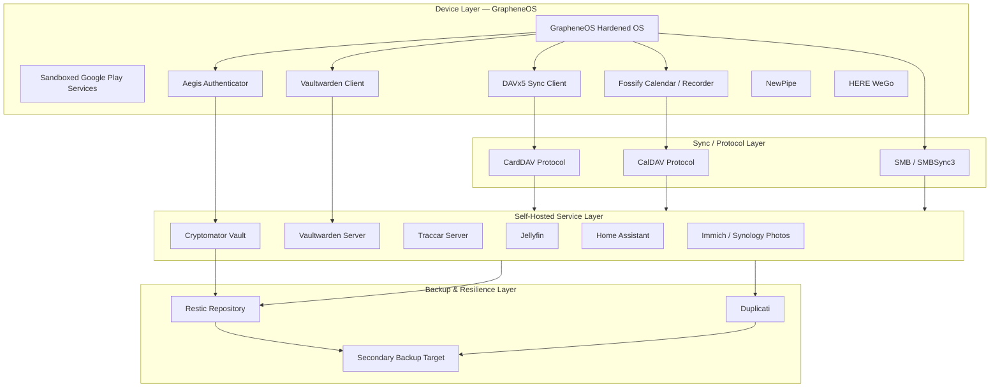
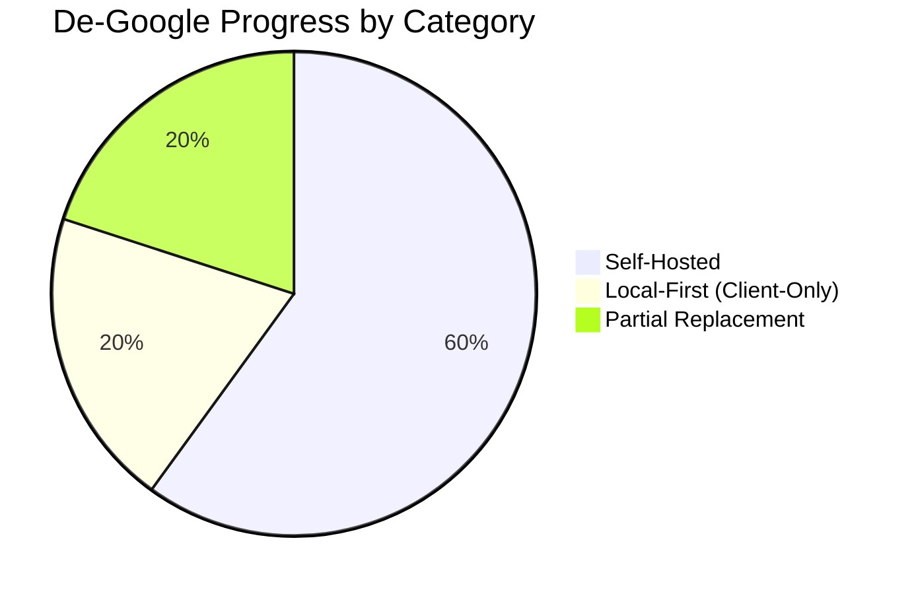
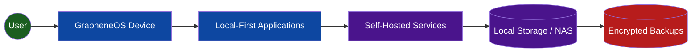
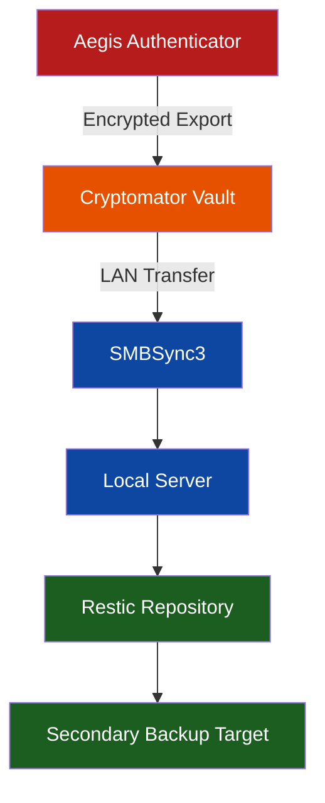
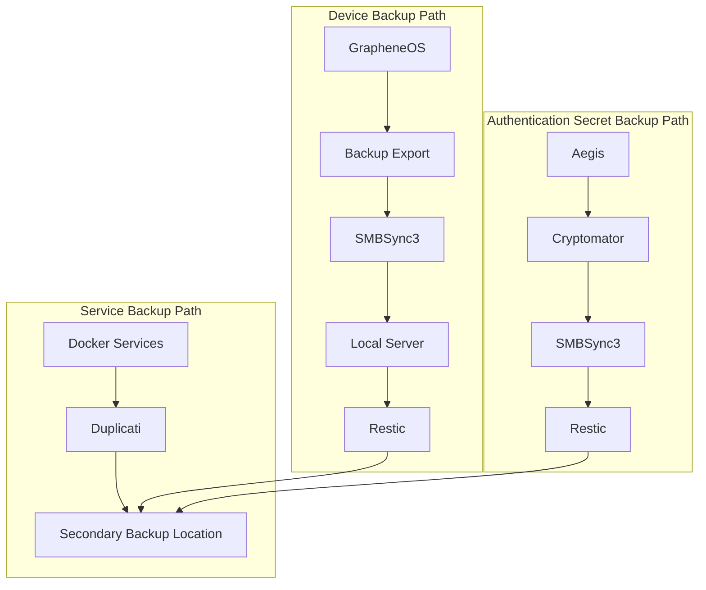
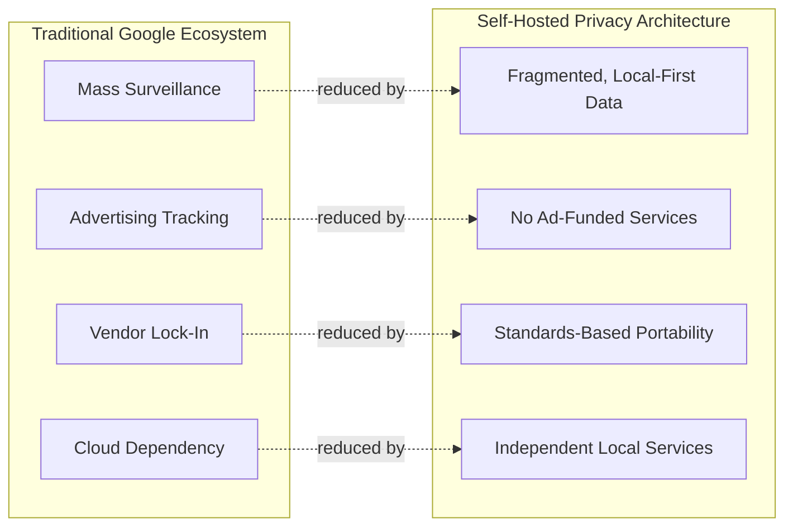

# De-Google Security & Data Sovereignty Architecture

**A Personal Privacy Infrastructure Whitepaper**

*Subtitle: A Security Architecture and Data Sovereignty Blueprint Built on GrapheneOS, Self-Hosted Services, and Local-First Design*

| Metadata | Value |
|---|---|
| Document Type | Security Architecture / Privacy Infrastructure Whitepaper |
| Classification | Personal — Non-Commercial |
| Scope | Mobile OS, Identity, Data Storage, Backup, Automation |
| Audience | Privacy seekers, Self-Hosters, GrapheneOS User |
| Status | Living Document |

---

## Table of Contents

1. [Executive Summary](#1-executive-summary)
2. [Goals](#2-goals)
3. [Privacy Principles](#3-privacy-principles)
4. [Architecture Overview](#4-architecture-overview)
5. [Google Service Replacement Matrix](#5-google-service-replacement-matrix)
6. [De-Google Progress Scorecard](#6-de-google-progress-scorecard)
7. [Data Ownership Matrix](#7-data-ownership-matrix)
8. [Data Sovereignty Analysis](#8-data-sovereignty-analysis)
9. [Architecture Decision Records (ADR)](#9-architecture-decision-records-adr)
10. [System Components](#10-system-components)
11. [Security Controls](#11-security-controls)
12. [Password Management](#12-password-management)
13. [Two-Factor Authentication (2FA)](#13-two-factor-authentication-2fa)
14. [Data Flows](#14-data-flows)
15. [Backup Strategy](#15-backup-strategy)
16. [Disaster Recovery Strategy](#16-disaster-recovery-strategy)
17. [Threat Model](#17-threat-model)
18. [Current Google Dependencies](#18-current-google-dependencies)
19. [Future Improvements](#19-future-improvements)
20. [Conclusion](#20-conclusion)

---

## 1. Executive Summary

This document describes the architecture of a personal, privacy-first computing ecosystem designed to progressively eliminate dependency on Google's cloud services while preserving day-to-day usability. The architecture is built around **GrapheneOS** as a hardened mobile operating system foundation, layered with **self-hosted**, **local-first**, and **open-source** replacements for identity, communication, media, automation, and backup functions historically provided by Google.

The design is not a step-by-step migration guide. It is a **security and data sovereignty blueprint** describing *why* each component was chosen, the *security and privacy properties* each component provides, and how the overall system reduces attack surface, vendor lock-in, and centralized data exposure while improving resilience, recoverability, and user control.

The architecture treats **authentication secrets** (2FA/TOTP seeds) and **credential material** (password vault contents) as the highest-value assets in the ecosystem — classified as Tier-0 — and applies the strongest layered protections (encryption, multiple independent backup copies, and offline retention) to these assets specifically.

At the time of writing, the ecosystem has eliminated the large majority of consumer-facing Google services, retaining only a narrowly scoped, sandboxed instance of Google Play Services for application compatibility purposes under GrapheneOS's isolation model.

---

## 2. Goals

| Goal | Description |
|---|---|
| Data Ownership | All personal data resides on infrastructure controlled by the user, not a third-party vendor. |
| Data Sovereignty | The user retains full authority over where data lives, how it is processed, and whether it leaves the local environment. |
| Local-First Architecture | Applications function primarily against local or self-hosted endpoints rather than depending on remote cloud APIs. |
| Reduced Cloud Dependency | Minimize reliance on any single commercial cloud provider for core functionality. |
| Open Source Preference | Favor auditable, community-reviewed software over closed-source binaries where functionally viable. |
| Defense in Depth | Apply overlapping, independent security controls rather than relying on a single protective layer. |
| Recovery Readiness | Ensure every category of data — especially authentication secrets — can be restored after device loss, corruption, or hardware failure. |
| Threat Reduction | Systematically reduce exposure to mass data collection, advertising telemetry, and centralized account compromise. |
| Vendor Independence | Avoid architectural lock-in to any single ecosystem, enabling components to be replaced independently. |

---

## 3. Privacy Principles

- **Minimize data leaving the device.** Prefer local processing and storage; treat any outbound data flow as something to be justified, not assumed.
- **Encryption as a default, not an afterthought.** Data at rest and in transit is encrypted by design across storage, sync, and backup layers.
- **No single point of trust.** Trust is distributed across independently verifiable open-source components rather than concentrated in one vendor.
- **Reduce metadata generation.** Favor tools and protocols that minimize the collection of secondary/derived data (location, usage patterns, contact graphs).
- **Segment services by function.** Identity, media, automation, and location services are logically and physically separated to contain the blast radius of any single compromise.
- **Everything must be recoverable.** A privacy architecture that cannot survive device loss is not resilient — recovery readiness is treated as a first-class privacy requirement, not just an operational one.
- **Prefer protocols over platforms.** Standard, portable protocols (CalDAV, CardDAV, WebDAV, SMB, restic repositories) are preferred over proprietary APIs to avoid future lock-in.

---

## 4. Architecture Overview

The ecosystem is organized into four logical layers:

1. **Device Layer** — GrapheneOS hardened mobile OS, sandboxed Google Play Services compatibility layer, and local-first applications (Fossify suite, DAVx5, Aegis, Bitwarden client, NewPipe, Poweramp).
2. **Sync/Protocol Layer** — Standards-based synchronization protocols (CardDAV, CalDAV, SMB) connecting device applications to self-hosted endpoints without routing through third-party cloud services.
3. **Self-Hosted Service Layer** — Homelab/NAS-hosted services (Immich/Synology Photos, Bitwarden, Traccar, Jellyfin, Home Assistant) that terminate data locally under user administrative control.
4. **Backup & Resilience Layer** — Independent backup pipelines (Restic, Duplicati, Cryptomator-encrypted exports) providing redundant, encrypted, recoverable copies of Tier-0 and Tier-1 assets.



---

## 5. Google Service Replacement Matrix

| Google Service | Replacement | Self-Hosted | Local-First | Privacy Benefit | Official Link |
|----------------|-------------|-------------|-------------|------------------|---------------|
| Android | GrapheneOS | N/A | Yes | Hardened Android and reduced Google integration | https://grapheneos.org |
| Google Contacts | DAVx5 + CardDAV Server | Yes | Yes | Data ownership | https://www.davx5.com |
| Google Calendar | Fossify Calendar + CalDAV Server | Yes | Yes | Self-hosted scheduling | https://www.fossify.org/calendar |
| Google Maps | HERE WeGo | No | Partial (Offline Maps) | Reduced telemetry | https://wego.here.com |
| Google Photos | Immich / Synology Photos | Yes | Yes | Self-hosted media ownership | https://immich.app |
| Google Password Manager | Vaultwarden Self Hosted | Yes | Yes | Encrypted credentials | https://bitwarden.com |
| Google Authenticator | Aegis Authenticator | N/A | Yes | User-controlled TOTP secrets and encrypted exports | https://getaegis.app |
| YouTube Account | NewPipe | No | N/A | Anonymous viewing | https://newpipe.net |
| Google Location History | Traccar Self Hosted | Yes | Yes | Self-owned location history | https://www.traccar.org |
| Google Drive Sync | SMBSync3 | Yes | Yes | LAN-only sync | https://github.com/Sentaroh/SMBSync3 |
| Google Drive Sensitive Files | Cryptomator | Optional | Yes | Client-side encryption | https://cryptomator.org |
| YouTube Music | Jellyfin / Poweramp | Yes | Yes | Media ownership | https://jellyfin.org |
| Google Recorder | Fossify Voice Recorder | No | Yes | Local recordings | https://www.fossify.org |
| Google Home | Home Assistant | Yes | Yes | Local automation | https://www.home-assistant.io |
| Google Backup Services | GrapheneOS Backup Export + SMBSync3 + Restic + Duplicati | Yes | Yes | Full backup ownership | https://grapheneos.org |

### Fully Replaced

Android OS layer, Contacts, Calendar, Photos, Password Management, Two-Factor Authentication, Location History, File Sync, Sensitive File Encryption, Music/Media Playback, Voice Recording, Home Automation, and Device/Data Backups have all been migrated to self-hosted, local-first, or open-source alternatives with no residual Google dependency for core functionality.

### Mostly Replaced

Mapping and navigation (HERE WeGo) and video consumption (NewPipe) achieve functional replacement but retain partial dependency on third-party data sources (HERE's map data, YouTube's content backend) even though the client-side tracking and account linkage to Google has been eliminated.

### Remaining Dependencies

Current dependency:

- Sandboxed Google Play Services (only where required for application compatibility)

This is the sole retained Google component and is discussed in detail in [Section 18](#18-current-google-dependencies).

---

## 6. De-Google Progress Scorecard

| Category | Count |
|---|---|
| Total Services Replaced | 15 / 15 |
| Fully Self-Hosted Replacements | 9 |
| Local-First Replacements | 12 |
| Partial / Non-Self-Hosted Replacements | 3 (Maps, YouTube, Voice Recorder — no server component required) |
| Remaining Google Dependencies | 1 (Sandboxed Google Play Services) |
| Overall De-Google Completion | ~93% (functional), 100% (account-level Google service usage eliminated) |



**Scorecard interpretation:** Every consumer-facing Google *account-bound* service has been replaced. The only remaining Google footprint is a sandboxed, isolated compatibility component, not an active data-collection surface tied to a Google account.

---

## 7. Data Ownership Matrix

| Data Type | Previous Google Service | Current Solution | Storage Location | Owner | Encrypted | Backup Method |
|---|---|---|---|---|---|---|
| Contacts | Google Contacts | DAVx5 + CardDAV Server | Local Server | User | Yes | Restic + Duplicati |
| Calendars | Google Calendar | Fossify Calendar + CalDAV | Local Server | User | Yes | Restic + Duplicati |
| Photos | Google Photos | Immich / Synology Photos | Local NAS | User | Yes | Restic + Duplicati |
| Videos | Google Photos | Immich / Synology Photos | Local NAS | User | Yes | Restic + Duplicati |
| Passwords | Google Password Manager | Vaultwarden (Self-Hosted) | Local Server | User | Yes | Restic + Duplicati |
| 2FA Secrets | Google Authenticator | Aegis Authenticator | GrapheneOS Device | User | Yes | Cryptomator + SMBSync3 + Restic |
| Location History | Google Location History | Traccar | Local Server | User | Yes | Restic |
| Music Library | YouTube Music | Jellyfin / Poweramp | Local NAS | User | Optional | Restic |
| Voice Recordings | Google Recorder | Fossify Voice Recorder | GrapheneOS Device | User | Device-level | SMBSync3 + Restic |
| Smart Home Data | Google Home | Home Assistant | Local Server | User | Yes | Restic + Duplicati |
| Device Backups | Google Backup | GrapheneOS Backup Export | Local Storage | User | Yes | SMBSync3 + Restic |
| Sensitive Files | Google Drive | Cryptomator | Local NAS | User | Yes (client-side) | Restic |
| File Synchronization | Google Drive Sync | SMBSync3 | LAN Only | User | Transport-dependent | N/A (transport layer) |

### Key Observations

- Every data category terminates in user-controlled storage; no data category has its authoritative copy held by a third-party cloud provider.
- Encryption is applied at the layer closest to the data's origin (client-side for Aegis and Cryptomator, at-rest for server-hosted services), minimizing the number of trust boundaries the plaintext ever crosses.
- Backup pipelines are deliberately duplicated (Restic *and* Duplicati, or Restic *and* SMBSync3) for Tier-0/Tier-1 categories, avoiding single-tool-failure risk.
- File synchronization is intentionally LAN-scoped, meaning contact/calendar/file sync data never traverses the public internet by default.

### Data Sovereignty Summary

- **Ownership:** All authoritative data copies exist on hardware physically controlled by the user (device + local server/NAS), not on vendor-operated infrastructure.
- **Control:** Access policies, retention periods, and deletion are governed entirely by user-configured software, not by a third-party terms-of-service agreement subject to unilateral change.
- **Portability:** Standards-based formats and protocols (CalDAV, CardDAV, restic snapshot format, standard photo/video containers) ensure data can move to a different self-hosted stack without conversion loss.
- **Resilience:** Multiple independent backup mechanisms per data tier reduce the probability that any single failure (software bug, ransomware, hardware fault) results in permanent data loss.
- **Privacy:** No data category routes through an advertising-funded analytics pipeline; metadata generation (usage patterns, device graphs, cross-service correlation) is structurally reduced by the absence of a unifying vendor account.
- **Independence from cloud providers:** The architecture has no single commercial dependency whose pricing, policy, or availability changes could force a migration under duress — each component can be replaced independently of the others.

---

## 8. Data Sovereignty Analysis

Data sovereignty in this architecture is evaluated across five dimensions: legal jurisdiction of storage, administrative control, encryption key custody, protocol openness, and recoverability without vendor involvement. Because storage is local (device + homelab), the user is the sole legal and administrative custodian of the data — no third-party data processing agreement, cloud terms of service, or foreign jurisdiction applies to the authoritative copy of any dataset.

### Authentication Secret Sovereignty

The migration from **Google Authenticator** to **Aegis Authenticator** represents a distinct and disproportionately important sovereignty improvement relative to its apparent simplicity.

Google Authenticator's cloud-backup mode ties TOTP seed material to a Google account, meaning the shared secrets that protect *every other* authenticated service in a user's life become indirectly dependent on the availability, security, and policy decisions of a single vendor account. A compromise, suspension, or lockout of that Google account has second-order consequences for every service relying on that authenticator.

Aegis Authenticator removes this dependency entirely:

- TOTP seeds are stored in a **local, encrypted vault** under exclusive user control.
- Backup and export are **explicit, user-initiated, and encrypted** — there is no implicit cloud sync channel.
- Recovery does not depend on the availability or trust of any external account.

This is arguably **the single most consequential sovereignty change in the entire architecture**, because 2FA secrets are the *root of trust* for recovering access to nearly every other self-hosted and cloud-adjacent service in the ecosystem (Vaultwarden, Home Assistant, Traccar, server administration panels). Sovereignty over this root of trust is a prerequisite for sovereignty over everything downstream of it.

---

## 9. Architecture Decision Records (ADR)

Each ADR follows the format: **Decision → Context → Alternatives Considered → Security Benefits → Privacy Benefits → Trade-Offs → Operational Considerations.**

### ADR-001: GrapheneOS

- **Decision:** Adopt GrapheneOS as the base mobile operating system.
- **Context:** Stock Android ships deeply integrated with Google services, telemetry, and account-bound backup/identity systems.
- **Alternatives Considered:** Stock Android (AOSP-based OEM ROM), LineageOS, CalyxOS, iOS.
- **Security Benefits:** Hardened memory allocator, exploit mitigations beyond upstream AOSP, per-network/per-app sandboxing of Google Play Services, verified boot with user-controlled keys.
- **Privacy Benefits:** No mandatory Google account binding, granular permission controls, network toggles per app, sandboxed rather than privileged Play Services.
- **Trade-Offs:** Reduced device compatibility (Pixel hardware only), some apps with strict Play Integrity checks may have degraded functionality.
- **Operational Considerations:** Requires periodic OS updates from the GrapheneOS project rather than OEM/carrier channels; sandboxed Play Services must be explicitly installed and scoped per-profile.

### ADR-002: DAVx5

- **Decision:** Use DAVx5 as the CardDAV/CalDAV sync client.
- **Context:** Contacts and calendar sync require a protocol-based bridge between device apps and a self-hosted server.
- **Alternatives Considered:** Google Contacts/Calendar sync, proprietary sync apps.
- **Security Benefits:** Open protocol implementation, no embedded analytics, standard TLS-secured transport to self-hosted endpoint.
- **Privacy Benefits:** No third-party intermediary between device and self-hosted server.
- **Trade-Offs:** Requires a self-hosted CalDAV/CardDAV server to be operated and maintained.
- **Operational Considerations:** Sync conflicts must be resolved manually in edge cases; server availability directly affects sync freshness.

### ADR-003: Fossify Calendar

- **Decision:** Use Fossify Calendar as the local calendar application.
- **Context:** Needed an open-source calendar UI that speaks CalDAV without embedded trackers.
- **Alternatives Considered:** Google Calendar app, Etar, Simple Calendar (predecessor project).
- **Security Benefits:** Minimal permission footprint, no bundled analytics SDKs.
- **Privacy Benefits:** Fully local rendering; calendar data does not pass through a third-party app backend.
- **Trade-Offs:** Fewer smart scheduling/AI features compared to Google Calendar.
- **Operational Considerations:** Relies on DAVx5 for sync; standalone use requires manual export/import.

### ADR-004: HERE WeGo

- **Decision:** Use HERE WeGo for mapping and navigation.
- **Context:** Full self-hosted mapping (e.g., OSM tile servers with routing) was evaluated but judged to add disproportionate operational burden relative to benefit at this stage.
- **Alternatives Considered:** Google Maps, OsmAnd, Self-hosted OSM/Valhalla routing stack.
- **Security Benefits:** Reduced background telemetry relative to Google Maps.
- **Privacy Benefits:** Offline map downloads reduce continuous location reporting; no Google account linkage.
- **Trade-Offs:** Still depends on a third-party map data provider; not fully self-hosted.
- **Operational Considerations:** Offline map packages require periodic manual updates.

### ADR-005: Immich

- **Decision:** Use Immich as the primary self-hosted photo/video platform.
- **Context:** Needed a Google Photos-equivalent with facial recognition, timeline view, and mobile auto-backup, without cloud storage.
- **Alternatives Considered:** Synology Photos, PhotoPrism, Nextcloud Memories.
- **Security Benefits:** Self-hosted API surface, authentication enforced at the homelab boundary, no external upload target.
- **Privacy Benefits:** ML-based features (face detection, object recognition) run entirely on local infrastructure — no image data leaves the network.
- **Trade-Offs:** Requires meaningful compute/storage resources on the host; project is under active, fast-moving development.
- **Operational Considerations:** Requires periodic updates and database maintenance; backup of the Immich database is as important as backup of the media library itself.

### ADR-006: Synology Photos

- **Decision:** Retain Synology Photos as an alternate/secondary photo backend where NAS-native integration is preferred.
- **Context:** Some workflows benefit from tighter integration with Synology DSM's native backup and permission model.
- **Alternatives Considered:** Immich as sole platform, PhotoPrism.
- **Security Benefits:** Vendor-maintained NAS OS security patching cadence; integrates with DSM's access control.
- **Privacy Benefits:** Data remains on-premises; no cloud tier required for core functionality.
- **Trade-Offs:** Closed-source application layer (though running on owned hardware); less flexible than Immich for cross-platform ML feature parity.
- **Operational Considerations:** Tied to Synology's software lifecycle and update cadence.

### ADR-007: Vaultwarden (Self-Hosted)

- **Decision:** Self-host Vaultwarden for password management.
- **Context:** Google Password Manager ties credential storage to a Google account and offers limited export/audit capability.
- **Alternatives Considered:** Google Password Manager, KeePass(XC), 1Password, Vaultwarden.
- **Security Benefits:** End-to-end encryption with zero-knowledge server design; self-hosting removes reliance on a third-party's infrastructure security posture.
- **Privacy Benefits:** No vendor visibility into vault metadata beyond what the protocol requires; full control of retention and audit logging.
- **Trade-Offs:** Operator is responsible for patching, TLS certificate management, and uptime of the vault server.
- **Operational Considerations:** Master password and emergency access/export procedures must be independently backed up; server compromise risk is now the operator's responsibility.

### ADR-008: Aegis Authenticator

- **Decision:** Use Aegis Authenticator for TOTP-based two-factor authentication.
- **Context:** Google Authenticator's cloud backup ties 2FA secrets to a Google account.
- **Alternatives Considered:** Google Authenticator, Microsoft Authenticator, Authy, andOTP (predecessor).
- **Security Benefits:** Local encrypted vault (AES-256-based), biometric/PIN vault lock, no network access required for operation.
- **Privacy Benefits:** No cloud sync channel by default; explicit, user-controlled encrypted export only.
- **Trade-Offs:** Loss of the device without a valid encrypted backup results in loss of all TOTP seeds unless recovery codes were separately stored.
- **Operational Considerations:** Encrypted export must be included in the regular backup rotation (see [Section 15](#15-backup-strategy)); this is treated as a Tier-0 operational requirement.

### ADR-009: NewPipe

- **Decision:** Use NewPipe for YouTube content consumption.
- **Context:** The official YouTube app requires a Google account for personalization and is heavily instrumented for advertising and behavioral tracking.
- **Alternatives Considered:** Official YouTube app, YouTube via browser, LibreTube.
- **Security Benefits:** No embedded Google SDKs or ad-tracking libraries.
- **Privacy Benefits:** No account binding; no watch history tied to a persistent identity.
- **Trade-Offs:** Relies on reverse-engineered API access, which can break with upstream changes; no official support channel.
- **Operational Considerations:** Requires periodic app updates to remain functional against YouTube backend changes.

### ADR-010: Traccar

- **Decision:** Self-host Traccar for personal location history.
- **Context:** Google Location History centralizes continuous location telemetry under a single vendor account.
- **Alternatives Considered:** Google Location History, OwnTracks with a self-hosted broker, GPSLogger with local export only.
- **Security Benefits:** Location data terminates at a self-hosted endpoint under the user's authentication controls.
- **Privacy Benefits:** No third-party ever receives raw location telemetry; retention policy is fully user-defined.
- **Trade-Offs:** Requires maintaining a always-available server endpoint for continuous logging; battery/network behavior must be tuned manually.
- **Operational Considerations:** Server must be reachable (or queue-and-retry configured) for uninterrupted logging; database growth requires periodic pruning.

### ADR-011: SMBSync3

- **Decision:** Use SMBSync3 for LAN-only file synchronization.
- **Context:** Google Drive's sync client routes file data through Google's cloud storage and account system.
- **Alternatives Considered:** Google Drive Sync, Syncthing, Nextcloud client.
- **Security Benefits:** Sync traffic is confined to the local network by default, reducing external exposure.
- **Privacy Benefits:** No cloud intermediary observes file metadata or content.
- **Trade-Offs:** No built-in off-network access; remote sync requires VPN or additional tooling.
- **Operational Considerations:** Sync only occurs when device and server share a network (or VPN); scheduling/triggers must be configured to ensure consistency.

### ADR-012: Jellyfin

- **Decision:** Use Jellyfin as the self-hosted media server for music and video.
- **Context:** YouTube Music ties media consumption to a Google account and streaming-dependent access.
- **Alternatives Considered:** YouTube Music, Plex, Navidrome.
- **Security Benefits:** Fully open-source server stack; no telemetry phone-home by default.
- **Privacy Benefits:** No vendor visibility into listening/viewing habits.
- **Trade-Offs:** Library must be manually curated and stored (no on-demand catalog like a commercial streaming service).
- **Operational Considerations:** Transcoding load depends on host hardware; remote access requires reverse proxy/VPN configuration.

### ADR-013: Home Assistant

- **Decision:** Use Home Assistant for local home automation.
- **Context:** Google Home routes automation logic and device state through Google's cloud infrastructure.
- **Alternatives Considered:** Google Home, Apple HomeKit, SmartThings, openHAB.
- **Security Benefits:** Automation execution occurs locally; no dependency on external cloud availability for core automations.
- **Privacy Benefits:** Device state and usage patterns remain on the local network unless explicitly integrated with an external service.
- **Trade-Offs:** Some smart-home devices with cloud-only APIs still require an internet round-trip regardless of the automation hub.
- **Operational Considerations:** Requires ongoing maintenance of integrations as device firmware and APIs evolve.

### ADR-014: Restic

- **Decision:** Use Restic as the primary backup engine for Tier-0 and Tier-1 assets.
- **Context:** Needed a deduplicating, encrypted, verifiable backup tool independent of any single storage vendor.
- **Alternatives Considered:** Duplicati (used as secondary), BorgBackup, rsync-based scripts.
- **Security Benefits:** Client-side encryption before data leaves the source; cryptographically verifiable snapshot integrity.
- **Privacy Benefits:** Backup repository can be stored on any storage backend without exposing plaintext to that backend.
- **Trade-Offs:** Command-line-oriented; requires disciplined key/password management (loss of the repository password is unrecoverable).
- **Operational Considerations:** Requires periodic `check`/verification runs and restore testing to confirm recoverability.

### ADR-015: Duplicati

- **Decision:** Use Duplicati as a secondary, independent backup mechanism for defense-in-depth.
- **Context:** Relying on a single backup tool creates a single point of software failure.
- **Alternatives Considered:** Restic as sole backup tool, Borgmatic, cloud-vendor backup agents.
- **Security Benefits:** AES-256 encrypted backup sets with independent key material from the Restic repository.
- **Privacy Benefits:** Provides an independent, GUI-manageable backup path for less technical recovery scenarios.
- **Trade-Offs:** Historically has had stability issues in some versions; should not be the sole backup mechanism.
- **Operational Considerations:** Used as a redundant path alongside Restic, not a replacement for it.

### ADR-016: Cryptomator

- **Decision:** Use Cryptomator for client-side encryption of sensitive files prior to sync/backup.
- **Context:** Some files (Tier-0 exports, sensitive documents) require encryption *before* they touch any sync or storage layer, regardless of that layer's own protections.
- **Alternatives Considered:** VeraCrypt containers, native filesystem encryption only, no additional encryption layer.
- **Security Benefits:** Files are encrypted client-side; the storage/sync backend never observes plaintext.
- **Privacy Benefits:** Adds a layer of protection independent of the trustworthiness of any given sync target or backup destination.
- **Trade-Offs:** Adds a manual step (mounting/unmounting the vault) to file access workflows.
- **Operational Considerations:** The Cryptomator vault password/key file is itself a Tier-0 asset and must be backed up with equal or greater rigor than the data it protects.

---

## 10. System Components

| Layer | Component | Role |
|---|---|---|
| OS | GrapheneOS | Hardened device foundation, sandboxing, permission enforcement |
| Compatibility | Sandboxed Google Play Services | Isolated app-compatibility layer only |
| Contacts/Calendar | DAVx5, Fossify Calendar | Local-first sync clients over CardDAV/CalDAV |
| Navigation | HERE WeGo | Offline-capable mapping |
| Media | Immich, Synology Photos, Jellyfin, Poweramp | Self-hosted photo/video/music ownership |
| Credentials | Vaultwarden | Self-hosted password vault |
| Authentication | Aegis Authenticator | Local encrypted TOTP vault |
| Video | NewPipe | Account-free content consumption |
| Location | Traccar | Self-hosted location history |
| File Sync | SMBSync3 | LAN-only synchronization |
| Encryption | Cryptomator | Client-side encrypted vault for sensitive files |
| Automation | Home Assistant | Local home automation hub |
| Backup | Restic, Duplicati | Independent encrypted backup pipelines |
| Voice | Fossify Voice Recorder | Local-only audio recording |

---

## 11. Security Controls

| Control Category | Implementation |
|---|---|
| Least Privilege | Per-app network and permission toggles enforced at the OS level (GrapheneOS) |
| Sandboxing | Google Play Services run as a sandboxed, non-privileged app rather than a system-level component |
| Encryption at Rest | Full-disk encryption on-device; encrypted vaults for credentials, 2FA, and sensitive files |
| Encryption in Transit | TLS for all CalDAV/CardDAV/Vaultwarden/Traccar/Home Assistant traffic |
| Segmentation | Distinct services (identity, media, automation, location) run as isolated processes/containers rather than a monolith |
| Reduced Attack Surface | LAN-scoped sync for file transfer; no unnecessary public internet exposure |
| Auditable Software | Preference for open-source components whose code can be independently reviewed |
| Backup Redundancy | Independent tools (Restic + Duplicati / SMBSync3) protect against single-tool failure |
| Recovery Verification | Periodic restore testing treated as a required control, not optional |

---

## 12. Password Management

Vaultwarden (self-hosted) serves as the central credential vault, replacing Google Password Manager. Its zero-knowledge encryption model ensures the server never has access to plaintext vault contents — the server stores only encrypted blobs, with decryption occurring client-side using a key derived from the user's master password.

**Security value:** Removes credential custody from a third-party account-bound password manager and places it under a self-administered, end-to-end encrypted system where the operator controls patching, access logging, and retention.

**Privacy value:** No vendor-side analytics on credential usage patterns; autofill and vault access events remain local to the client and self-hosted server.

**Ownership benefit:** The vault export format is portable and can be migrated to any compatible password manager without vendor cooperation.

**Trade-off:** The self-hosting operator assumes responsibility for server security; a compromised or unpatched Vaultwarden server instance becomes the weakest link, shifting risk from "trusting a large vendor's security team" to "trusting one's own operational discipline."

---

## 13. Two-Factor Authentication (2FA)

### Google Authenticator Replacement

**Replacing:** Google Authenticator
**Tool:** Aegis Authenticator
**Official Website:** https://getaegis.app
**Source Code:** https://github.com/beemdevelopment/Aegis

Aegis is built around a local-first design: TOTP/HOTP secrets are stored in an encrypted, on-device vault with no default cloud synchronization channel. This design directly addresses the primary privacy and sovereignty weakness of Google Authenticator's cloud-backup mode, which binds 2FA secrets to a Google account's availability and security posture.

Key properties:

- **Open-source implementation** — code is publicly auditable, reducing the reliance on vendor assurances.
- **Local-first design** — the vault exists and functions entirely offline.
- **Offline operation** — TOTP code generation requires no network connectivity at all.
- **No cloud dependency** — there is no default backend service to be compromised, deprecated, or subpoenaed.
- **Ownership of TOTP secrets** — seeds are stored exclusively in a vault the user controls the key material for.
- **Encrypted vault support** — the on-device database itself is encrypted, in addition to any exported backup.
- **Export and backup functionality** — the app provides deliberate, user-initiated encrypted export for backup integration (see [Aegis Backup Architecture](#aegis-backup-architecture)).

#### Comparison Table

| Feature | Aegis | Google Authenticator | Microsoft Authenticator | Authy |
|---|---|---|---|---|
| Open Source | Yes | No | No | No |
| Local-Only by Default | Yes | No (cloud backup default) | No (cloud backup default) | No (cloud-tied) |
| Cloud Sync Required | No | Optional but default-on in recent versions | Optional but promoted | Required for multi-device |
| Encrypted Local Vault | Yes | Not user-inspectable | Not user-inspectable | Not user-inspectable |
| Encrypted Manual Export | Yes | Limited | Limited | Limited |
| Account Binding Required | No | Google Account (for backup) | Microsoft Account (for backup) | Phone number-bound account |
| Auditable Codebase | Yes (public repository) | No | No | No |

**Open-source transparency:** Aegis's publicly auditable codebase allows independent verification of its cryptographic implementation and absence of covert network calls — a property closed-source authenticators cannot offer.

**Local ownership:** Because the vault and its export format are fully under user control, the seed material can be migrated, inspected, or restored without depending on any vendor's continued existence or policy.

**Cloud dependence differences:** Google/Microsoft Authenticator's default cloud-backup behavior means a compromised or locked account can cascade into loss or exposure of 2FA secrets for unrelated services — a correlation risk Aegis's local-only model avoids by design.

**Security implications:** Centralizing 2FA recovery inside a single cloud account (as with cloud-synced authenticators) creates a high-value single point of failure; Aegis's local model trades sync convenience for a smaller, user-controlled trust boundary.

### Protecting Authentication Secrets

2FA secrets are one of the most critical assets in the entire ecosystem, because they function as the **root of trust for regaining access to every other service** — including the very systems (Vaultwarden, Home Assistant, Traccar, server administration) that this architecture depends on. A password can often be reset through a secondary channel; a lost TOTP seed frequently cannot be regenerated at all without falling back to (often weaker) account-recovery mechanisms.

Discussed risks:

- **Device loss** — the primary vault copy becomes physically inaccessible.
- **Device corruption** — software or storage failure renders the on-device vault unreadable.
- **Inability to access Vaultwarden** — if 2FA is also required to unlock the password vault, losing TOTP secrets can create a circular lockout.
- **Home Assistant lockout** — loss of 2FA can sever administrative access to home automation infrastructure.
- **Traccar lockout** — loss of 2FA can prevent access to self-hosted location history administration.
- **Server administration lockout** — loss of 2FA on infrastructure-level accounts can block recovery operations entirely, compounding the original failure.

These risks are the direct motivation for the dedicated backup architecture described in [Aegis Backup Architecture](#aegis-backup-architecture) and the Tier-0 classification in [Section 14](#14-data-flows).

---

## 14. Data Flows

### Critical Asset Classification

| Classification | Assets |
|---|---|
| Tier-0 (Critical) | Aegis Authenticator Database, Bitwarden Vault, Cryptomator Recovery Material, Encryption Keys |
| Tier-1 (Important) | Contacts, Calendars, Home Assistant Data, Traccar Data |
| Tier-2 (Recoverable) | Photos, Videos, Music, Voice Recordings |

**Why Tier-0 assets require the strongest controls:** Tier-0 assets are distinguished by being *non-regenerable and gating* — they are either impossible to recreate after loss (a TOTP shared secret cannot be re-derived without re-enrolling with every service) or they act as the sole key to unlocking every other tier of data (an encryption key or vault master password). Loss of a Tier-1 or Tier-2 asset is an inconvenience; loss of a Tier-0 asset can be an irrecoverable, cascading failure across the entire ecosystem. Accordingly, Tier-0 assets receive multiple independent, encrypted, geographically or media-separated backup copies with mandatory periodic restore verification, while Tier-1/Tier-2 assets receive standard backup coverage proportional to their recoverability.

### Data Flow Diagram



This flow demonstrates that no data category's *primary* path includes a third-party cloud hop — every arrow terminates within infrastructure the user owns or a client-side encrypted boundary, in contrast to a traditional Google-centric flow where the primary path routes through vendor cloud infrastructure by default.

---

## 15. Backup Strategy

### GrapheneOS Backup Strategy

```
GrapheneOS
  -> Backup Export
  -> Local Storage
  -> SMBSync3
  -> LAN Server
  -> Restic Repository
```

This pipeline keeps device backup data entirely within the local network boundary until it reaches the Restic repository, at which point it may optionally be replicated to a secondary, geographically separate target. This preserves **local-only backups** for the majority of the pipeline, supports **recovery readiness** by ensuring a device-level backup always exists independent of any cloud vendor, and enables both **device recovery** (restoring a wiped or replaced GrapheneOS device) and **data recovery** (retrieving specific files/settings without a full device restore).

### Aegis Backup Architecture

```
Aegis Authenticator
  -> Encrypted Export
  -> Cryptomator Vault
  -> SMBSync3
  -> Local Server
  -> Restic Repository
  -> Secondary Backup Target
```



Key design properties:

- **Encrypted exports only** — the Aegis vault is never exported or transmitted in plaintext at any stage of the pipeline.
- **Multiple backup copies** — the same encrypted export exists simultaneously inside the Cryptomator vault, the Restic repository, and the secondary backup target.
- **Offline retention** — at least one copy of the backup chain is retained on media that is not continuously network-accessible, reducing exposure to remote compromise or ransomware.
- **Backup validation** — Restic snapshot integrity checks are run periodically to confirm the backup chain has not silently corrupted.
- **Recovery testing** — restoration is periodically exercised end-to-end (without altering the live vault) to confirm that the backup chain is actually usable in a real recovery scenario, not merely present.

### Backup Architecture Overview



---

## 16. Disaster Recovery Strategy

| Scenario | Consideration |
|---|---|
| Device Loss | Recovery depends on the most recent GrapheneOS backup export and the independently stored Aegis encrypted export; both must exist outside the lost device to be usable. |
| Device Failure | Similar to device loss, but may allow partial data recovery from device storage prior to full restoration from backup. |
| NAS Failure | Restic and Duplicati repositories stored on a secondary target allow restoration of self-hosted service data and media libraries without depending on the primary NAS surviving. |
| Docker Failure | Containerized self-hosted services (Immich, Vaultwarden, Traccar, Home Assistant) are recreated from configuration and restored from their respective Duplicati/Restic backup sets rather than manual reconfiguration. |
| Backup Corruption | Redundant backup tools (Restic + Duplicati) reduce the likelihood that a single corrupted backup set results in total data loss; periodic verification detects corruption before it is needed. |
| Recovery Validation | Restoration is periodically tested against a non-production target to confirm backups are actually restorable, not merely present. |

### Recovery of Two-Factor Authentication

The recovery of 2FA secrets is treated as the most sensitive disaster recovery scenario in the architecture, given its role as a gating asset for other recoveries (see [Section 13](#13-two-factor-authentication-2fa)).

Discussion points (procedures intentionally omitted):

- **Device loss** — recovery relies entirely on the existence of a valid, decryptable encrypted export stored outside the lost device.
- **Device corruption** — similar dependency on the external encrypted export; on-device-only backups provide no protection against this scenario.
- **Accidental deletion** — mitigated by retaining multiple historical export snapshots rather than only the most recent one, reducing the risk that a deletion event is backed up before it can be caught.
- **Backup restoration validation** — the encrypted export is periodically test-restored to confirm both the encryption key/passphrase and the export file itself remain valid and usable.
- **Recovery readiness** — the overall goal is that no single failure event (device loss, corruption, or accidental deletion) can result in permanent loss of 2FA access to any downstream service.

---

## 17. Threat Model

| Threat | Traditional Google Ecosystem Exposure | This Architecture's Mitigation |
|---|---|---|
| Mass Surveillance | Account-linked cross-service data aggregation | No unifying vendor account; data fragmented across independent self-hosted services |
| Advertising Tracking | Behavioral profiling across search, video, maps, email | No advertising-funded services in the primary data path |
| Metadata Collection | Continuous device, location, and usage metadata harvesting | Local-first design minimizes metadata generation and transmission |
| Cloud Account Compromise | Single compromised account can expose contacts, photos, location, and more | No single account grants access to all services; compromise is contained per-service |
| Vendor Lock-In | Proprietary formats and APIs discourage migration | Standards-based protocols (CalDAV/CardDAV/restic) preserve portability |
| Excessive Permissions | Bundled apps request broad device permissions | GrapheneOS enforces granular, per-app permission and network scoping |
| Third Party Analytics | Embedded SDKs report usage to advertising networks | Preference for open-source apps without bundled analytics SDKs |
| Centralized Service Outages | A vendor-wide outage can disable multiple services simultaneously | Self-hosted services fail independently; a single service outage does not cascade |
| Loss of 2FA Secrets | Cloud-account-bound recovery, subject to vendor account-recovery process | Mitigated through encrypted Aegis exports, Cryptomator, SMBSync3, and Restic backups with periodic recovery validation |

**Loss of 2FA Secrets — mitigation detail:** This threat is mitigated through a layered chain: the Aegis vault is exported in encrypted form, that export is placed inside a Cryptomator-encrypted vault for an additional independent encryption boundary, the result is synchronized via SMBSync3 to a local server, retained in a Restic repository with integrity verification, and periodically validated through non-destructive test restores — ensuring the mitigation is proven functional rather than assumed.



---

## 18. Current Google Dependencies

The architecture retains exactly one Google-associated component: **Sandboxed Google Play Services**, operating under GrapheneOS's isolation model rather than as a privileged system component.

**Why retained:** A subset of third-party applications rely on Google Play Services APIs (push notification delivery, certain SDK dependencies) for correct functionality. Removing it entirely would break compatibility with some applications that have no viable open-source equivalent.

**GrapheneOS isolation model:** Under GrapheneOS, Play Services runs as an ordinary, unprivileged application rather than a system-level service with elevated access. It can be scoped to specific user profiles, denied network access on a per-app basis, and does not have the elevated system permissions it holds on stock Android.

**Reduced trust boundaries:** Because Play Services is sandboxed rather than system-integrated, its ability to access other apps' data, device identifiers, or background telemetry channels is substantially constrained compared to a stock Android installation.

**Residual risks:** Even sandboxed, Play Services remains closed-source code from a single vendor; its network behavior, while constrained, cannot be independently audited to the same degree as the open-source components in the rest of the architecture. It is treated as a contained, monitored exception rather than a trusted component.

---

## 19. Future Improvements

- **Self-hosted email** — reduce remaining reliance on third-party email providers for primary communication.
- **Self-hosted document storage** — extend the self-hosted model to office/document editing and storage.
- **Self-hosted search** — evaluate local/self-hosted search indexing to reduce dependency on commercial search engines for personal data lookups.
- **Local AI services** — explore on-device or self-hosted AI/ML inference to avoid sending personal data to third-party AI providers.
- **Network segmentation** — further isolate homelab services into distinct VLANs or trust zones to limit lateral movement in the event of a single service compromise.
- **Backup validation automation** — automate periodic integrity checks and test restores across all backup pipelines rather than relying on manual verification.
- **Disaster recovery testing** — formalize a recurring, scheduled disaster recovery exercise covering device loss, NAS failure, and Tier-0 asset recovery scenarios.

---

## 20. Conclusion

This architecture demonstrates that a comprehensive, functionally complete alternative to a Google-centric digital life is achievable through a combination of a hardened mobile operating system, standards-based self-hosted services, local-first application design, and layered, independently verifiable backup infrastructure. By treating data ownership, sovereignty, and recovery readiness as first-class architectural requirements — not afterthoughts — the ecosystem achieves meaningful reductions in mass surveillance exposure, advertising telemetry, vendor lock-in, and centralized single points of failure.

The explicit classification and hardened protection of Tier-0 assets — particularly authentication secrets — reflects a mature understanding that privacy and security architectures are only as strong as their weakest recoverable link. The transition from Google Authenticator to Aegis Authenticator stands out as a disproportionately significant sovereignty gain, transferring custody of the root of trust for the entire ecosystem from a vendor-controlled account to user-controlled, encrypted, and independently verifiable infrastructure.

The one remaining Google dependency — sandboxed Google Play Services — is a deliberate, scoped, and monitored exception rather than an oversight, and its removal (or further isolation) remains an open item on the future improvement roadmap.

---

*This document is maintained as a living architecture record and should be revised as components are added, replaced, or deprecated.*
