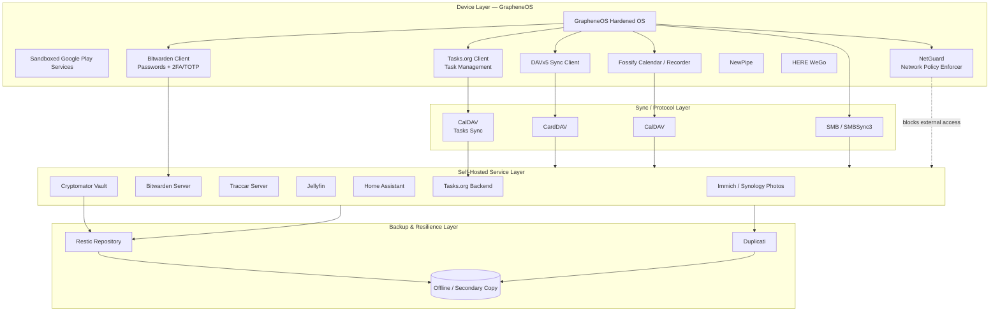
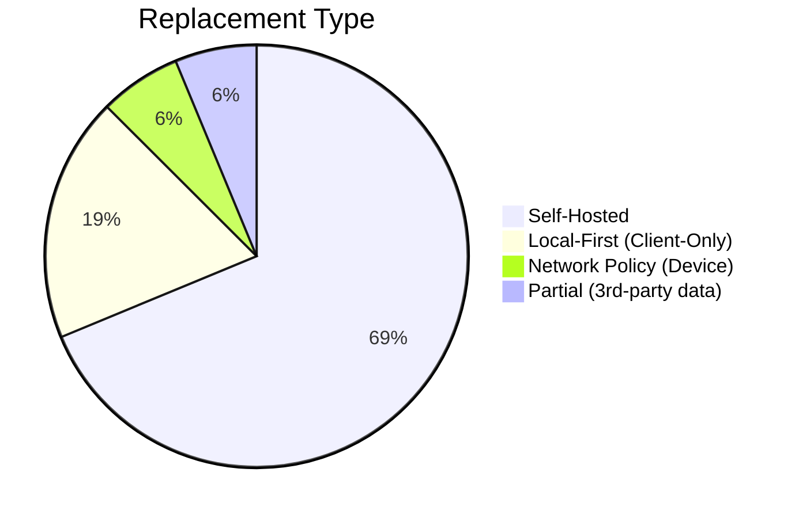
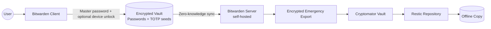
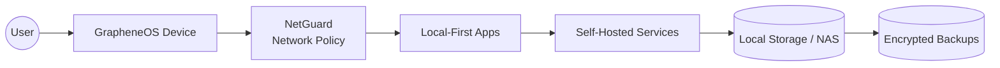
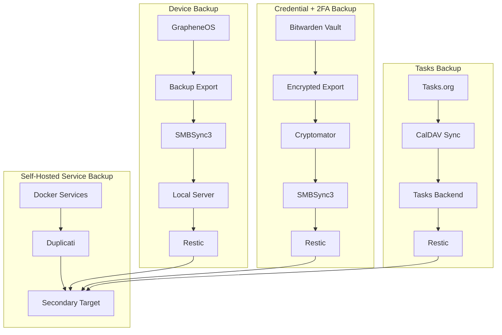
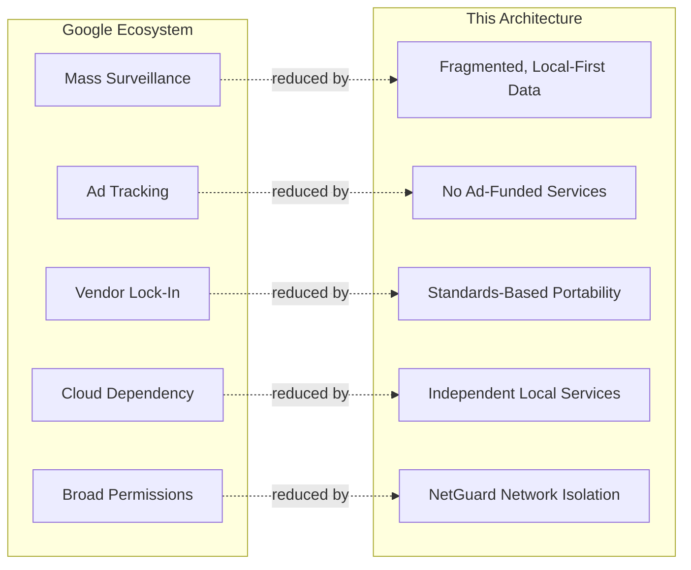

# De-Google Security & Data Sovereignty Architecture

**A Personal Privacy Infrastructure Blueprint** — GrapheneOS + self-hosted services + local-first design.

| Metadata | Value |
|---|---|
| Document Type | Security Architecture / Privacy Infrastructure Whitepaper |
| Classification | Personal — Non-Commercial |
| Scope | Mobile OS, Identity, Data Storage, Backup, Automation |
| Audience | Privacy seekers, Self-Hosters, GrapheneOS User |
| Status | Living Document |

## Table of Contents

1. [Architecture Overview](#1-architecture-overview)
2. [Google Service Replacement Matrix](#2-google-service-replacement-matrix)
3. [Progress Scorecard](#3-progress-scorecard)
4. [Data Ownership Matrix](#4-data-ownership-matrix)
5. [Architecture Decision Records](#5-architecture-decision-records)
6. [Credential & 2FA Architecture (Bitwarden)](#6-credential--2fa-architecture-bitwarden)
7. [Data Criticality Tiers & Flow](#7-data-criticality-tiers--flow)
8. [Backup Architecture](#8-backup-architecture)
9. [Disaster Recovery](#9-disaster-recovery)
10. [Threat Model](#10-threat-model)
11. [Remaining Google Dependency](#11-remaining-google-dependency)
12. [What's Possible Next](#12-whats-possible-next)

---

## 1. Architecture Overview

**Goal:** Every category of personal data terminates on infrastructure the user controls (device or homelab), reachable over open protocols, with independent encrypted backups — no Google account as a unifying identity.

Four layers:

| Layer | What lives here |
|---|---|
| **Device** | GrapheneOS, sandboxed Google Play Services (compatibility only), local-first apps, NetGuard (network policy enforcement) |
| **Sync/Protocol** | CardDAV, CalDAV, SMB — open protocols, no vendor API in the path |
| **Self-Hosted Services** | Homelab/NAS: Immich, Bitwarden, Traccar, Jellyfin, Home Assistant, Tasks.org backend |
| **Backup/Resilience** | Restic + Duplicati, one copy always offline |

**How it works end to end:** a device app talks only to a self-hosted endpoint over a standard protocol → the self-hosted service is the single source of truth → every service's data is pulled into encrypted backups independently. NetGuard enforces network policy at the device layer, ensuring only approved LAN connectivity and blocking internet access for services that should be local-only.

---

## 2. Google Service Replacement Matrix

| Google Service | Replacement | Self-Hosted | Local-First |
|----------------|-------------|:---:|:---:|
| Android | GrapheneOS | N/A | ✔ |
| Contacts | DAVx5 + CardDAV | ✔ | ✔ |
| Calendar | Fossify Calendar + CalDAV | ✔ | ✔ |
| Tasks | **Tasks.org + CalDAV** | ✔ | ✔ |
| Maps | HERE WeGo | ✖ | Partial (offline maps) |
| Photos | Immich / Synology Photos | ✔ | ✔ |
| Password Manager **+** Authenticator | **Bitwarden (self-hosted)** — vault + built-in TOTP | ✔ | ✔ |
| YouTube | NewPipe | ✖ | N/A |
| Location History | Traccar | ✔ | ✔ |
| Drive Sync | SMBSync3 | ✔ | ✔ |
| Drive (sensitive files) | Cryptomator | Optional | ✔ |
| YouTube Music | Jellyfin / Poweramp | ✔ | ✔ |
| Recorder | Fossify Voice Recorder | ✖ | ✔ |
| Home | Home Assistant | ✔ | ✔ |
| Network Policy Engine | **NetGuard** — per-app firewall, LAN-only enforcement | N/A | ✔ |
| Backup | GrapheneOS Export + SMBSync3 + Restic/Duplicati | ✔ | ✔ |

**Only remaining Google footprint:** sandboxed Google Play Services, kept for app compatibility only (see [Section 11](#11-remaining-google-dependency)).

---

## 3. Progress Scorecard

| Metric | Value |
|---|---|
| Services replaced | 16 / 16 |
| Fully self-hosted | 11 |
| Client-only / local-first | 3 (Maps, YouTube, Voice Recorder) |
| Network policy enforcement | 1 (NetGuard) |
| Remaining Google dependency | 1 (sandboxed Play Services) |
| Account-level Google usage | 0% |

---

## 4. Data Ownership Matrix

| Data | Solution | Location | Encrypted | Backup |
|---|---|---|:---:|---|
| Contacts / Calendar | DAVx5 + Fossify | Local server | ✔ | Restic + Duplicati |
| Tasks | **Tasks.org + CalDAV** | Local server | ✔ | Restic + Duplicati |
| Photos / Videos | Immich / Synology Photos | Local NAS | ✔ | Restic + Duplicati |
| Passwords + 2FA/TOTP | **Bitwarden (self-hosted)** | Local server | ✔ (zero-knowledge) | Restic + Duplicati + encrypted vault export |
| Location History | Traccar | Local server | ✔ | Restic |
| Music / Video Library | Jellyfin / Poweramp | Local NAS | Optional | Restic |
| Voice Recordings | Fossify Voice Recorder | Device | Device-level | SMBSync3 + Restic |
| Smart Home Data | Home Assistant | Local server | ✔ | Restic + Duplicati |
| Device Backup | GrapheneOS Export | Local storage | ✔ | SMBSync3 + Restic |
| Sensitive Files | Cryptomator | Local NAS | ✔ (client-side) | Restic |
| File Sync | SMBSync3 | LAN only | Transport-dependent | N/A |
| Network Policy | NetGuard rules | Device | N/A (per-app firewall) | Device config export |

**Why this works:** encryption happens as close to the data's origin as possible (client-side for Bitwarden and Cryptomator), so plaintext crosses the fewest possible trust boundaries. Network policy is enforced at the device layer via NetGuard, preventing unauthorized external leakage. Every row has an independent backup chain.

---

## 5. Architecture Decision Records

| ADR | Decision | Replaces | Key Security/Privacy Win | Main Trade-off |
|---|---|---|---|---|
| 001 | GrapheneOS | Stock Android | Hardened allocator, sandboxed Play Services, no forced Google account | Pixel-only hardware |
| 002 | DAVx5 | Google account sync | Open protocol (CalDAV/CardDAV), no intermediary | Requires self-hosted DAV server |
| 003 | Fossify Calendar | Google Calendar app | No bundled analytics, local rendering | Fewer "smart" scheduling features |
| 004 | **Tasks.org + CalDAV** | **Google Tasks** | **Open protocol task sync, self-hosted backend, no proprietary lock-in** | **Requires CalDAV-compatible task server** |
| 005 | HERE WeGo | Google Maps | Offline maps, no account linkage | Still a 3rd-party map data source |
| 006 | Immich | Google Photos | Local ML (face/object detection), no upload target | Needs real compute/storage; fast-moving project |
| 007 | Synology Photos | Google Photos (alt.) | NAS-native integration, on-prem | Closed-source app layer |
| 008 | **Bitwarden (self-hosted)** | Google Password Manager **+ Google Authenticator** | Zero-knowledge vault **and** built-in TOTP generator in one encrypted store — single root of trust instead of two | Storing TOTP seeds alongside passwords (mitigated by encryption + backup strategy) |
| 009 | NewPipe | YouTube app | No embedded SDKs, no account binding | Depends on reverse-engineered API |
| 010 | Traccar | Google Location History | Self-hosted, user-defined retention | Needs an always-reachable endpoint |
| 011 | SMBSync3 | Google Drive Sync | LAN-scoped, no cloud intermediary | No off-network access without VPN |
| 012 | Jellyfin | YouTube Music | Open-source, no telemetry | Manual library curation |
| 013 | Home Assistant | Google Home | Local automation execution | Some devices still need cloud round-trips |
| 014 | **NetGuard** | **Implicit Android network permissions model** | **Per-app firewall, explicit LAN-only enforcement, blocks unauthorized external access** | **Requires active management; device-dependent** |
| 015 | Restic | — | Client-side encrypted, deduplicated, verifiable | CLI-driven; repo password loss = unrecoverable |
| 016 | Duplicati | — (secondary to Restic) | Independent key material, GUI recovery path | Historically less stable; never the sole backup |
| 017 | Cryptomator | Google Drive (sensitive files) | Encrypts before data reaches any sync/storage layer | Adds manual mount/unmount step |

---

## 6. Credential & 2FA Architecture (Bitwarden)

**Merged design:** passwords and TOTP/2FA secrets live in **one self-hosted Bitwarden vault** instead of two separate tools (password manager + Aegis). Bitwarden's built-in authenticator field stores the TOTP seed; a periodic encrypted vault export serves as the disaster-recovery copy.

**How it works:**
- Client-side encryption/decryption — the server only ever stores encrypted blobs and never sees a master password or plaintext vault contents.
- One unlock (master password + optional biometric/device unlock) grants both the stored password *and* its live TOTP code — no second app, no second vault to keep in sync.
- A periodic **encrypted emergency export** is the disaster-recovery copy: it flows through Cryptomator → Restic → an offline/secondary target, independent of the live server.

**What this makes possible:**
- One root of trust to protect and back up instead of two (previously: Bitwarden vault + separate Aegis database).
- One recovery procedure covers both credentials and 2FA — no risk of restoring a password vault but losing the matching TOTP seed (or vice versa).
- Self-hosting removes the account-bound cloud dependency of Google Password Manager and Google Authenticator alike.

**Trade-off:** storing TOTP seeds in the same vault as the passwords they protect narrows the separation-of-secrets model — a full vault compromise now exposes both factors together. This is accepted because: (1) encryption is client-side, so the server never sees plaintext; (2) NetGuard enforces network boundaries, limiting lateral attack surface; (3) the backup chain is independent and encrypted.

---

## 7. Data Criticality Tiers & Flow

| Tier | Assets | Why |
|---|---|---|
| **Tier-0** | Bitwarden vault (passwords + TOTP), encryption keys, Cryptomator recovery material, NetGuard policy config | Non-regenerable and gating — losing them can lock out every other service |
| **Tier-1** | Contacts, calendars, tasks, Home Assistant data, Traccar data | Important, but recreatable/re-syncable |
| **Tier-2** | Photos, videos, music, voice recordings | Recoverable from other copies/devices |

Every arrow terminates in user-owned infrastructure or a client-side encrypted boundary — no primary path includes a third-party cloud hop. NetGuard sits at the device layer to enforce network isolation.

---

## 8. Backup Architecture

| Property | Implementation |
|---|---|
| Encrypted at every hop | Vault exports and Cryptomator layer are encrypted before touching sync/storage; Tasks sync via CalDAV over TLS |
| Redundant tools | Restic + Duplicati are independent — one tool's bug or corruption doesn't take down both |
| Offline copy | At least one backup copy is not continuously network-reachable |
| Verified, not assumed | Restic `check` + periodic test-restore confirm the chain is actually usable |
| Network-isolated services | NetGuard enforces that backup traffic stays LAN-bound; no external leakage |

---

## 9. Disaster Recovery

| Scenario | Recovery path |
|---|---|
| Device loss/failure | Restore from GrapheneOS backup export + Bitwarden vault sync/export (both stored off-device) |
| Tasks loss | Restore Tasks.org database from Restic/Duplicati; re-sync via CalDAV client |
| NAS failure | Restic/Duplicati repositories on secondary target restore services + media without the primary NAS |
| Docker/service failure | Recreate container from config, restore data from Duplicati/Restic |
| Backup corruption | Redundant tools + periodic verification catch this before it's needed |
| NetGuard config loss | Device factory reset maintains baseline GrapheneOS privacy; re-apply NetGuard policy from backup |
| **Vault (passwords + 2FA) loss** | Single recovery path: decrypt the latest Bitwarden encrypted export → restores both credentials and TOTP seeds together |

**Why the merge simplifies recovery:** previously, losing 2FA access required a separate Aegis-export recovery procedure that could leave Bitwarden itself locked out. With TOTP inside Bitwarden, one restore covers both.

---

## 10. Threat Model

| Threat | Google Ecosystem Exposure | Mitigation Here |
|---|---|---|
| Mass surveillance | Cross-service data aggregation under one account | No unifying account; data fragmented across independent self-hosted services |
| Advertising tracking | Behavioral profiling | No ad-funded service in the primary data path |
| Cloud account compromise | One account exposes contacts, photos, location, credentials | Compromise is contained per self-hosted service |
| Vendor lock-in | Proprietary formats/APIs | Open protocols (CalDAV/CardDAV/restic) preserve portability |
| Excessive permissions | Broad bundled-app permissions | GrapheneOS per-app network/permission scoping + **NetGuard per-app firewall** |
| Unauthorized network access | Apps making unexpected external connections | **NetGuard blocks all outbound except to approved LAN addresses** |
| Service-to-internet leakage | Internal services accidentally reaching out | **NetGuard LAN-only policy prevents cross-boundary data flow** |
| Vault/2FA loss | Account-recovery flow controlled by vendor | Encrypted export chain (Section 8) with periodic restore testing |
| Service outage | Vendor-wide outage disables multiple services | Self-hosted services fail independently |

---

## 11. Remaining Google Dependency

**Sandboxed Google Play Services** — the only Google component still present, kept for apps requiring push notification delivery or SDKs with no open-source equivalent.

| Property | Detail |
|---|---|
| Privilege level | Ordinary unprivileged app, not a system service |
| Isolation | Scoped per profile, network access toggled per app, **further restricted by NetGuard** |
| Residual risk | Closed-source, cannot be fully audited — treated as a contained, monitored exception |
| Network enforcement | NetGuard can disable Play Services internet access entirely if unused |

---

## 12. What's Possible Next

| Idea | What it would replace | Enables |
|---|---|---|
| Self-hosted email | 3rd-party email provider | Full mail sovereignty, no provider-side scanning |
| Self-hosted document storage/editing | Google Docs/Drive | On-prem office suite, no upload of document content |
| Self-hosted search index | Commercial search engines (for personal data) | Local lookup over self-hosted data without external queries |
| Local AI inference | Cloud AI providers | On-device/self-hosted ML without sending personal data out |
| Network segmentation (VLANs) | Flat homelab network + NetGuard | Limits lateral movement if one service is compromised; NetGuard provides app-layer enforcement |
| Automated backup validation | Manual restore checks | Continuous proof that every backup chain is actually restorable |
| Hardware key (FIDO2) for admin accounts | Bitwarden-only 2FA on high-value accounts | Second factor independent of the vault, closing the trade-off in Section 6 |
| Advanced threat analysis | NetGuard logs review | Detect abnormal network behavior before it becomes a breach |

---

*Living document — update as components are added, replaced, or deprecated.*
