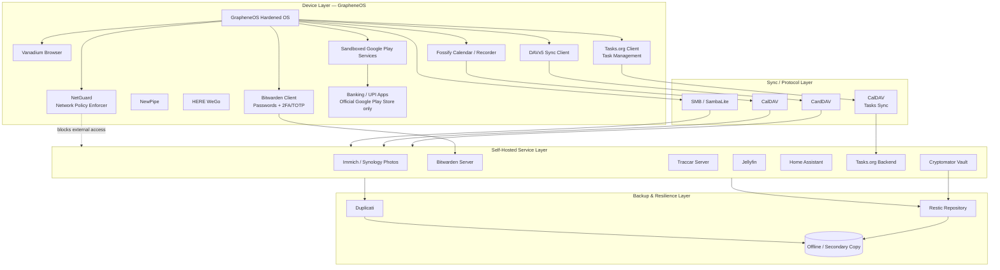
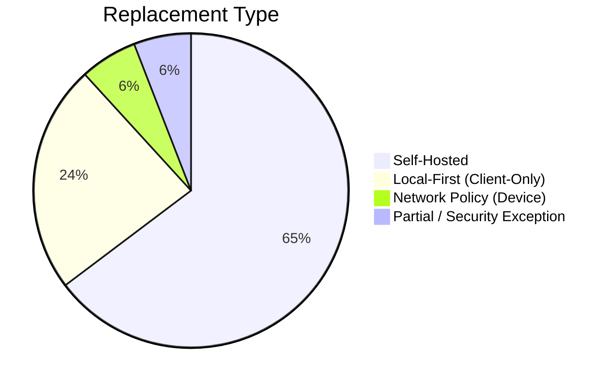
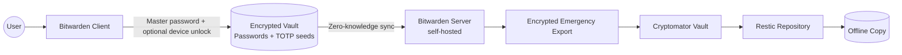
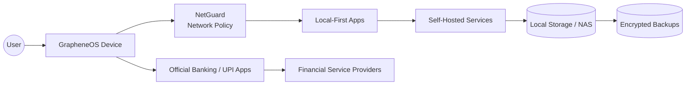
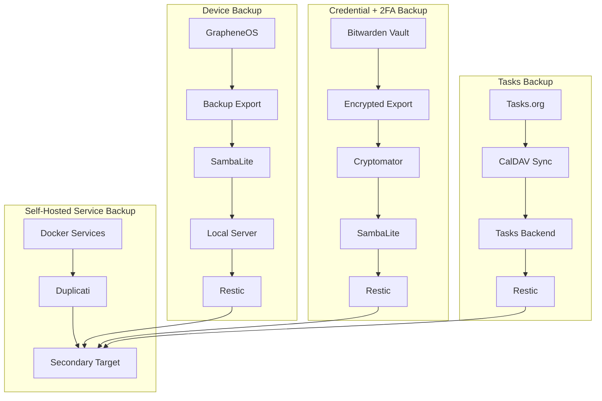
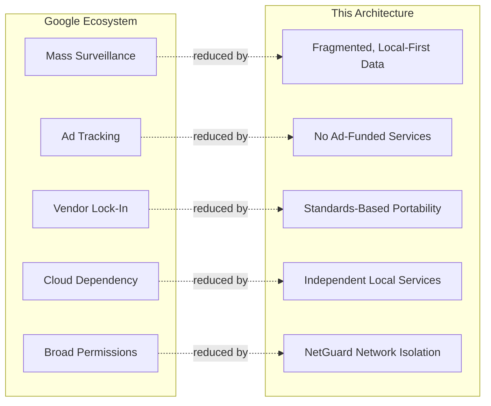

# De-Google Security & Data Sovereignty Architecture

**A Personal Privacy Infrastructure Blueprint** — GrapheneOS + self-hosted services + local-first design.

| Metadata | Value |
|---|---|
| Document Type | Security Architecture / Privacy Infrastructure Whitepaper |
| Classification | Personal — Non-Commercial |
| Scope | Mobile OS, Identity, Data Storage, Backup, Automation |
| Audience | Privacy seekers, Self-Hosters, GrapheneOS User |
| Status | Living Document |

## Table of Contents

1. [Architecture Overview](#1-architecture-overview)
2. [Google Service Replacement Matrix](#2-google-service-replacement-matrix)
3. [Progress Scorecard](#3-progress-scorecard)
4. [Data Ownership Matrix](#4-data-ownership-matrix)
5. [Architecture Decision Records](#5-architecture-decision-records)
6. [Credential & 2FA Architecture (Bitwarden)](#6-credential--2fa-architecture-bitwarden)
7. [Data Criticality Tiers & Flow](#7-data-criticality-tiers--flow)
8. [Backup Architecture](#8-backup-architecture)
9. [Disaster Recovery](#9-disaster-recovery)
10. [Threat Model](#10-threat-model)
11. [Remaining Google Dependency](#11-remaining-google-dependency)
12. [Security Exceptions](#12-security-exceptions)
13. [What's Possible Next](#13-whats-possible-next)

---

## 1. Architecture Overview

**Goal:** Every category of personal data terminates on infrastructure the user controls (device or homelab), reachable over open protocols, with independent encrypted backups — no Google account dependency, no vendor lock-in, and no cloud-only data retention.

Four layers:

| Layer | What lives here |
|---|---|
| **Device** | GrapheneOS, Vanadium, sandboxed Google Play Services (compatibility and banking exceptions only), local-first apps, and NetGuard (network policy enforcement) |
| **Sync/Protocol** | CardDAV, CalDAV, SMB — open protocols, no vendor API in the path |
| **Self-Hosted Services** | Homelab/NAS: Immich, Bitwarden, Traccar, Jellyfin, Home Assistant, Tasks.org backend |
| **Backup/Resilience** | Restic + Duplicati, one copy always offline |

**How it works end to end:** device apps use local-first storage or talk to a self-hosted endpoint over a standard protocol → the self-hosted service is the single source of truth → every service's data is pulled into a user-owned backup flow. Vanadium is the default general-purpose browser, while banking and UPI applications are a narrowly scoped exception described in [Section 12](#12-security-exceptions).

---

## 2. Google Service Replacement Matrix

| Google Service | Replacement | Self-Hosted | Local-First |
|----------------|-------------|:---:|:---:|
| Android | GrapheneOS | N/A | ✔ |
| Browser | [Vanadium](https://github.com/GrapheneOS/Vanadium) | N/A | ✔ |
| Contacts | DAVx5 + CardDAV | ✔ | ✔ |
| Calendar | Fossify Calendar + CalDAV | ✔ | ✔ |
| Tasks | **Tasks.org + CalDAV** | ✔ | ✔ |
| Maps | HERE WeGo | ✖ | Partial (offline maps) |
| Photos | Immich / Synology Photos | ✔ | ✔ |
| Password Manager **+** Authenticator | **Bitwarden (self-hosted)** — vault + built-in TOTP | ✔ | ✔ |
| YouTube | NewPipe | ✖ | N/A |
| Location History | Traccar | ✔ | ✔ |
| Drive Sync | SambaLite | ✔ | ✔ |
| Drive (sensitive files) | Cryptomator | Optional | ✔ |
| YouTube Music | Jellyfin / Poweramp | ✔ | ✔ |
| Recorder | Fossify Voice Recorder | ✖ | ✔ |
| Home | Home Assistant | ✔ | ✔ |
| Banking / UPI payments | Official apps from sandboxed Google Play Store — security exception | ✖ | Partial |
| Network Policy Engine | **NetGuard** — per-app firewall, LAN-only enforcement | N/A | ✔ |
| Backup | GrapheneOS Export + SambaLite + Restic/Duplicati | ✔ | ✔ |

**Only remaining Google footprint:** sandboxed Google Play Services and the Google Play Store, retained only for app compatibility and the banking/UPI security exception documented in [Section 12](#12-security-exceptions).

---

## 3. Progress Scorecard

| Metric | Value |
|---|---|
| Services replaced | 17 / 17 |
| Fully self-hosted | 11 |
| Client-only / local-first | 4 (Browser, Maps, YouTube, Voice Recorder) |
| Security exceptions | 1 (banking / UPI apps from sandboxed Google Play Store) |
| Network policy enforcement | 1 (NetGuard) |
| Remaining Google dependency | Sandboxed Play Services + Play Store exception |
| Account-level Google usage | 0% |

---

## 4. Data Ownership Matrix

| Data | Solution | Location | Encrypted | Backup |
|---|---|---|:---:|---|
| Contacts / Calendar | DAVx5 + Fossify | Local server | ✔ | Restic + Duplicati |
| Tasks | **Tasks.org + CalDAV** | Local server | ✔ | Restic + Duplicati |
| Photos / Videos | Immich / Synology Photos | Local NAS | ✔ | Restic + Duplicati |
| Passwords + 2FA/TOTP | **Bitwarden (self-hosted)** | Local server | ✔ (zero-knowledge) | Restic + Duplicati + encrypted vault export |
| Location History | Traccar | Local server | ✔ | Restic |
| Music / Video Library | Jellyfin / Poweramp | Local NAS | Optional | Restic |
| Voice Recordings | Fossify Voice Recorder | Device | Device-level | SambaLite + Restic |
| Smart Home Data | Home Assistant | Local server | ✔ | Restic + Duplicati |
| Device Backup | GrapheneOS Export | Local storage | ✔ | SambaLite + Restic |
| Sensitive Files | Cryptomator | Local NAS | ✔ (client-side) | Restic |
| File Sync | SambaLite | LAN only | Transport-dependent | N/A |
| Browser Data | Vanadium | Device / user-controlled export | Device-level | GrapheneOS Export + SambaLite |
| Banking / UPI Data | Official apps from sandboxed Google Play Store | Device / provider systems | App- and provider-dependent | Provider-controlled; do not back up secrets insecurely |
| Network Policy | NetGuard rules | Device | N/A (per-app firewall) | Device config export |

**Why this works:** encryption happens as close to the data's origin as possible (client-side for Bitwarden and Cryptomator), so plaintext crosses the fewest possible trust boundaries. Network policy is enforced at the device layer to keep traffic local. Banking and UPI applications are deliberately excluded from the self-hosted data path because their integrity and official distribution are higher priorities than eliminating this narrow Google dependency.

---

## 5. Architecture Decision Records

| ADR | Decision | Replaces | Key Security/Privacy Win | Main Trade-off |
|---|---|---|---|---|
| 001 | GrapheneOS | Stock Android | Hardened allocator, sandboxed Play Services, no forced Google account | Pixel-only hardware |
| 002 | DAVx5 | Google account sync | Open protocol (CalDAV/CardDAV), no intermediary | Requires self-hosted DAV server |
| 003 | Fossify Calendar | Google Calendar app | No bundled analytics, local rendering | Fewer "smart" scheduling features |
| 004 | **Tasks.org + CalDAV** | **Google Tasks** | **Open protocol task sync, self-hosted backend, no proprietary lock-in** | **Requires CalDAV-compatible task server** |
| 005 | HERE WeGo | Google Maps | Offline maps, no account linkage | Still a 3rd-party map data source |
| 006 | Immich | Google Photos | Local ML, no upload target | Needs real compute/storage; fast-moving project |
| 007 | Synology Photos | Google Photos (alt.) | NAS-native integration, on-prem | Closed-source app layer |
| 008 | **Bitwarden (self-hosted)** | Google Password Manager **+ Google Authenticator** | Zero-knowledge vault and built-in TOTP generator in one encrypted store | Higher risk if the master vault is compromised |
| 009 | NewPipe | YouTube app | No embedded SDKs, no account binding | Depends on reverse-engineered API |
| 010 | Traccar | Google Location History | Self-hosted, user-defined retention | Needs an always-reachable endpoint |
| 011 | SambaLite | Google Drive Sync | LAN-scoped, no cloud intermediary | No off-network access without VPN |
| 012 | Jellyfin | YouTube Music | Open-source, no telemetry | Manual library curation |
| 013 | Home Assistant | Google Home | Local automation execution | Some devices still need cloud round-trips |
| 014 | **NetGuard** | **Implicit Android network permissions model** | **Per-app firewall and explicit LAN-only enforcement** | Requires active management |
| 015 | Restic | — | Client-side encrypted, deduplicated, verifiable | CLI-driven; repo password loss = unrecoverable |
| 016 | Duplicati | — (secondary to Restic) | Independent key material, GUI recovery path | Historically less stable; never the sole backup |
| 017 | Cryptomator | Google Drive (sensitive files) | Encrypts before data reaches any sync/storage layer | Adds manual mount/unmount step |
| 018 | **Vanadium** | Default OS browser / Chromium-based browser alternatives | GrapheneOS-integrated, privacy-focused browsing with no Google account requirement | Not a complete substitute for every browser-specific web compatibility case |
| 019 | **Official banking and UPI apps from sandboxed Google Play Store** | Untrusted APK mirrors or sideloaded financial apps | Official distribution helps verify publisher, package, and update provenance; minimizes tampering risk | Retains a tightly scoped Google Play dependency and third-party app/cloud exposure |

---

## 6. Credential & 2FA Architecture (Bitwarden)

**Merged design:** passwords and TOTP/2FA secrets live in **one self-hosted Bitwarden vault** instead of two separate tools (password manager + Aegis). Bitwarden's built-in authenticator field streamlines secure recovery and avoids drift between two independent secret stores.

**How it works:**
- Client-side encryption/decryption means the server only ever stores encrypted blobs and never sees a master password or plaintext vault contents.
- One unlock grants both the stored password and its live TOTP code — no second app or second vault to keep in sync.
- A periodic **encrypted emergency export** flows through Cryptomator → Restic → an offline/secondary target.

**Trade-off:** storing TOTP seeds with passwords narrows the separation-of-secrets model — a full vault compromise exposes both factors together. This is accepted because the vault is locally encrypted, self-hosted, and backed up with independent verification.

---

## 7. Data Criticality Tiers & Flow

| Tier | Assets | Why |
|---|---|---|
| **Tier-0** | Bitwarden vault, encryption keys, Cryptomator recovery material, NetGuard policy config | Non-regenerable and gating — losing them can lock out every other service |
| **Tier-1** | Contacts, calendars, tasks, Home Assistant data, Traccar data | Important, but recreatable/re-syncable |
| **Tier-2** | Photos, videos, music, voice recordings | Recoverable from other copies/devices |
| **Tier-3** | Banking and UPI applications | Financially sensitive; use only official distributions and protect device/app authentication |

Every primary self-hosted arrow terminates in user-owned infrastructure or a client-side encrypted boundary. Banking and UPI apps are the explicit exception: they communicate with their financial providers and must be obtained from the official sandboxed Google Play Store distribution channel.

---

## 8. Backup Architecture

| Property | Implementation |
|---|---|
| Encrypted at every hop | Vault exports and Cryptomator layer are encrypted before touching sync/storage; Tasks sync via CalDAV over TLS |
| Redundant tools | Restic + Duplicati are independent — one tool's bug or corruption doesn't take down both |
| Offline copy | At least one backup copy is not continuously network-reachable |
| Verified, not assumed | Restic `check` + periodic test-restore confirm the chain is actually usable |
| Network-isolated services | NetGuard enforces that backup traffic stays LAN-bound; no external leakage |
| Financial app secrets | Do not export or back up banking credentials, PINs, or payment secrets through ordinary sync jobs; use the provider's recovery process |

---

## 9. Disaster Recovery

| Scenario | Recovery path |
|---|---|
| Device loss/failure | Restore from GrapheneOS backup export + Bitwarden vault sync/export (both stored off-device) |
| Tasks loss | Restore Tasks.org database from Restic/Duplicati; re-sync via CalDAV client |
| NAS failure | Restic/Duplicati repositories on secondary target restore services + media without the primary NAS |
| Docker/service failure | Recreate container from config, restore data from Duplicati/Restic |
| Backup corruption | Redundant tools + periodic verification catch this before it's needed |
| NetGuard config loss | Device factory reset maintains baseline GrapheneOS privacy; re-apply NetGuard policy from backup |
| **Vault (passwords + 2FA) loss** | Decrypt the latest Bitwarden encrypted export to restore credentials and TOTP seeds together |
| Banking / UPI app loss | Reinstall the official app from the sandboxed Google Play Store and complete the provider's identity/device recovery process; do not use APK mirrors |

---

## 10. Threat Model

| Threat | Google Ecosystem Exposure | Mitigation Here |
|---|---|---|
| Mass surveillance | Cross-service data aggregation under one account | No unifying account; data fragmented across independent self-hosted services |
| Advertising tracking | Behavioral profiling | No ad-funded service in the primary data path |
| Cloud account compromise | One account exposes contacts, photos, location, credentials | Compromise is contained per self-hosted service |
| Vendor lock-in | Proprietary formats/APIs | Open protocols (CalDAV/CardDAV/restic) preserve portability |
| Excessive permissions | Broad bundled-app permissions | GrapheneOS per-app network/permission scoping + **NetGuard per-app firewall** |
| Unauthorized network access | Apps making unexpected external connections | **NetGuard blocks all outbound except to approved LAN addresses** where practical |
| Service-to-internet leakage | Internal services accidentally reaching out | **NetGuard LAN-only policy prevents cross-boundary data flow** |
| Malicious or tampered financial APK | Sideloaded APK may be modified or have an untrusted provenance | Banking and UPI apps are installed only from their official Google Play Store listings in the sandboxed profile |
| Browser tracking | Default or account-bound browser may send telemetry or encourage cloud sync | Vanadium is the default browser; no Google account is required |
| Vault/2FA loss | Account-recovery flow controlled by vendor | Encrypted export chain with periodic restore testing |
| Service outage | Vendor-wide outage disables multiple services | Self-hosted services fail independently |

---

## 11. Remaining Google Dependency

**Sandboxed Google Play Services** and the **sandboxed Google Play Store** are retained as narrowly scoped exceptions:

- Play Services remains available for apps requiring push notification delivery, Google APIs, or SDKs with no open-source equivalent.
- The Play Store is used specifically to install banking and UPI payment apps from their official listings rather than relying on APK mirrors or unknown sideload sources.
- These components are ordinary sandboxed apps on GrapheneOS, not privileged system services. Keep them in a separate profile where practical, restrict network access with NetGuard when it does not break required functionality, and avoid signing into a Google account unless an app genuinely requires it.

| Property | Detail |
|---|---|
| Privilege level | Ordinary unprivileged apps, not system services |
| Isolation | Scoped per profile, network access toggled per app, further restricted by NetGuard |
| Residual risk | Closed-source components and provider-dependent financial apps remain a contained, monitored exception |
| Network enforcement | NetGuard can disable Play Services internet access when unused; banking/UPI apps require their provider connectivity |
| Distribution integrity | Banking and UPI apps are installed only from official Google Play Store listings; verify the developer/publisher and package before installation |

---

## 12. Security Exceptions

### Banking and UPI payment applications

Banking and UPI payment applications are an explicit, limited exception to the otherwise de-Googled application strategy. They should be downloaded from the **official Google Play Store running as a sandboxed GrapheneOS app**, not from APK mirrors, unofficial repositories, or random direct-download links.

This is intentional for application integrity and provenance: the official store listing provides a known publisher/package relationship and a signed update distribution path, helping reduce the risk that a financial application has been modified or tampered with before installation. Users should still verify the developer name, package identity, requested permissions, and update behavior; official distribution is a risk reduction, not a guarantee that the banking provider itself is trustworthy.

Recommended controls:

- Install only the bank or UPI provider's official listing from the sandboxed Play Store.
- Keep banking and payment apps in a separate user profile where practical.
- Do not install financial APKs from mirrors or accept APKs sent through messages or email.
- Grant only the permissions required for the app to function, and use NetGuard to restrict unrelated network access where possible.
- Use device unlock, app-level security features, transaction notifications, and provider-supported recovery controls.
- Never include banking passwords, PINs, OTPs, tokens, or payment secrets in SambaLite, Restic, Duplicati, or ordinary device exports.

### Vanadium as the default browser

[Vanadium](https://github.com/GrapheneOS/Vanadium) replaces the browser application supplied by the default OS/browser setup. It is the general-purpose browser for this architecture and does not require a Google account. Browser data should remain local to the device or be included only in an encrypted, user-controlled device backup.

Vanadium does not replace the banking/UPI distribution requirement: financial apps remain native applications installed from the sandboxed official Play Store, while Vanadium is used for ordinary web browsing and provider web portals where appropriate.

---

## 13. What's Possible Next

| Idea | What it would replace | Enables |
|---|---|---|
| Self-hosted email | 3rd-party email provider | Full mail sovereignty, no provider-side scanning |
| Self-hosted document storage/editing | Google Docs/Drive | On-prem office suite, no upload of document content |
| Self-hosted search index | Commercial search engines (for personal data) | Local lookup over self-hosted data without external queries |
| Local AI inference | Cloud AI providers | On-device/self-hosted ML without sending personal data out |
| Network segmentation (VLANs) | Flat homelab network + NetGuard | Limits lateral movement if one service is compromised; NetGuard provides app-layer enforcement |
| Automated backup validation | Manual restore checks | Continuous proof that every backup chain is actually restorable |
| Hardware key (FIDO2) for admin accounts | Bitwarden-only 2FA on high-value accounts | Second factor independent of the vault, closing the trade-off in Section 6 |
| Advanced threat analysis | NetGuard logs review | Detect abnormal network behavior before it becomes a breach |

---

*Living document — update as components are added, replaced, or deprecated.*
