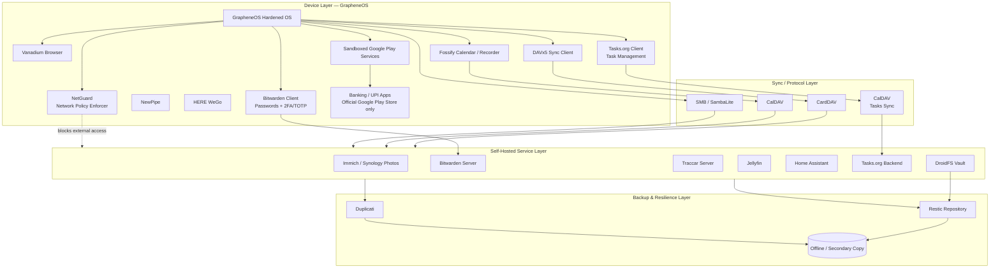
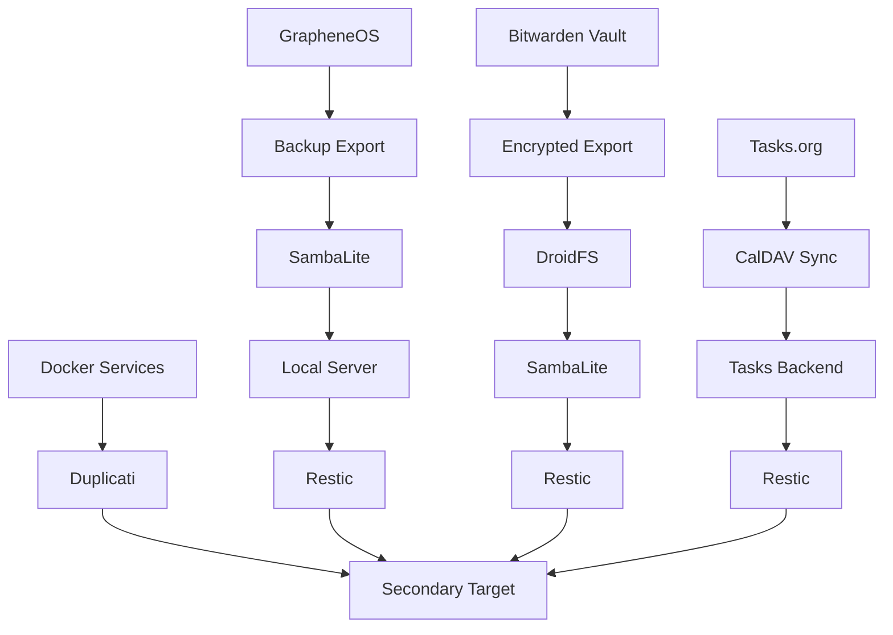

# De-Google Security & Data Sovereignty Architecture

**A Personal Privacy Infrastructure Blueprint** — GrapheneOS + self-hosted services + local-first design.

| Metadata | Value |
|---|---|
| Document Type | Security Architecture / Privacy Infrastructure Whitepaper |
| Classification | Personal — Non-Commercial |
| Scope | Mobile OS, Identity, Data Storage, Backup, Automation |
| Audience | Privacy seekers, Self-Hosters, GrapheneOS Users |
| Status | Living Document |

## Table of Contents

1. [Architecture Overview](#1-architecture-overview)
2. [GrapheneOS Security Features](#2-grapheneos-security-features)
3. [Google Service Replacement Matrix](#3-google-service-replacement-matrix)
4. [Progress Scorecard](#4-progress-scorecard)
5. [Data Ownership Matrix](#5-data-ownership-matrix)
6. [Architecture Decision Records](#6-architecture-decision-records)
7. [Credential & 2FA Architecture](#7-credential--2fa-architecture)
8. [Data Criticality Tiers & Flow](#8-data-criticality-tiers--flow)
9. [Backup Architecture](#9-backup-architecture)
10. [Disaster Recovery](#10-disaster-recovery)
11. [Threat Model](#11-threat-model)
12. [Remaining Google Dependency](#12-remaining-google-dependency)
13. [Security Exceptions](#13-security-exceptions)
14. [What's Possible Next](#14-whats-possible-next)

---

## 1. Architecture Overview

**Goal:** Every category of personal data terminates on infrastructure the user controls (device or homelab), reachable over open protocols, with independent encrypted backups — no Google account dependence for primary data flow.

Four layers:

| Layer | What lives here |
|---|---|
| **Device** | GrapheneOS, Vanadium, sandboxed Google Play Services (compatibility and banking exceptions only), local-first apps, and NetGuard |
| **Sync/Protocol** | CardDAV, CalDAV, SMB — open protocols, no vendor API in the path |
| **Self-Hosted Services** | Homelab/NAS: Immich, Bitwarden, Traccar, Jellyfin, Home Assistant, Tasks.org backend |
| **Backup/Resilience** | Restic + Duplicati, one copy always offline |

**How it works end to end:** device apps use local-first storage or talk to a self-hosted endpoint over a standard protocol → the self-hosted service is the single source of truth → every service's data is independently backed up and recoverable.

---

## 2. GrapheneOS Security Features

GrapheneOS is a security and privacy-focused mobile operating system based on the Android Open Source Project (AOSP). The features below are the security foundation for this architecture.

### Physical Access & Device Unlock Protections

- **Duress PIN / Password (Destructive PIN):** An alternate lock-screen PIN or password can trigger an irreversible wipe of the entire device, including eSIMs, at the OS level.
- **PIN Scrambling Layout:** Randomizes the number keypad placement on every unlock to reduce shoulder-surfing and fingerprint-smudge analysis.
- **USB-C Data Restrictions:** Blocks USB-C data connections while locked at the hardware and OS-driver levels. Charging-only or complete USB disablement can be configured.
- **Auto-Reboot Timer:** Automatically restarts the device after a configured period of inactivity (18 hours by default), moving it from After First Unlock (AFU) to Before First Unlock (BFU) and re-enabling stronger protections.
- **Two-Factor Fingerprint Unlock:** An optional second-factor short PIN can be required alongside biometrics. The maximum biometric attempts are reduced from AOSP's 20 to 5 to resist hardware brute-force attacks.
- **128-Character Passwords:** Supports passwords up to 128 characters rather than AOSP's standard 16-character alphanumeric limit, enabling high-entropy passphrases.

### Exploit Mitigation & Memory Hardening

- **Hardened Malloc & MTE:** Uses `hardened_malloc` to mitigate memory-corruption vulnerabilities such as use-after-free and buffer overflows, with strict ARM Memory Tagging Extension (MTE) rules on compatible devices.
- **Secure App Spawning:** Allows disabling the standard Android Zygote process model so random memory secrets, including ASLR layout hashes, are not universally shared between app processes.
- **Kernel & Browser Hardening:** Includes Vanadium, a hardened Chromium-based browser with JavaScript JIT disabled by default, type-based Control Flow Integrity, and hybrid post-quantum encryption.

### Network & Privacy Granularity

- **Network & Sensors Toggles:** Explicit system-level toggles can remove an application's internet or hardware-sensor access independently of ordinary Android permissions.
- **Storage and Contact Scopes:** Scopes replace blanket permissions, exposing only selected files, folders, or contact entries to an application.
- **LTE-Only Mode:** Reduces cellular-modem attack surface by disabling vulnerable legacy infrastructure such as 2G and 3G and ignoring unencrypted 5G configurations to help defend against IMSI catchers.
- **Advanced Wi-Fi Anonymization:** Scrambles probe sequence numbers alongside MAC randomization to reduce tracking through local-network probes.

### Hardware Attestation

- **Auditor App:** Uses hardware-backed verification and a secondary device to scan a cryptographic QR code. This verifies that the phone's firmware, secure element, and operating system have not been tampered with.

These controls are complementary: a strong passphrase and reboot policy protect data at rest, exploit mitigations reduce the impact of application and kernel vulnerabilities, scopes and toggles limit data exposure, and hardware attestation provides a measurable baseline for trust.

---

## 3. Google Service Replacement Matrix

| Google Service | Replacement | Self-Hosted | Local-First |
|---|---|:---:|:---:|
| Android | GrapheneOS | N/A | ✔ |
| Browser | [Vanadium](https://github.com/GrapheneOS/Vanadium) | N/A | ✔ |
| Contacts | DAVx5 + CardDAV | ✔ | ✔ |
| Calendar | Fossify Calendar + CalDAV | ✔ | ✔ |
| Tasks | **Tasks.org + CalDAV** | ✔ | ✔ |
| Maps | HERE WeGo | ✖ | Partial (offline maps) |
| Photos | Immich / Synology Photos | ✔ | ✔ |
| Password Manager + Authenticator | **Bitwarden (self-hosted)** — vault + built-in TOTP | ✔ | ✔ |
| YouTube | NewPipe | ✖ | N/A |
| Location History | Traccar | ✔ | ✔ |
| Drive Sync | SambaLite | ✔ | ✔ |
| Drive (sensitive files) | DroidFS | Optional | ✔ |
| YouTube Music | Jellyfin / Poweramp | ✔ | ✔ |
| Recorder | Fossify Voice Recorder | ✖ | ✔ |
| Home | Home Assistant | ✔ | ✔ |
| Banking / UPI payments | Official apps from sandboxed Google Play Store — security exception | ✖ | Partial |
| Network Policy Engine | **NetGuard** — per-app firewall, LAN-only enforcement | N/A | ✔ |
| Backup | GrapheneOS Export + SambaLite + Restic/Duplicati | ✔ | ✔ |

**Only remaining Google footprint:** sandboxed Google Play Services and the Google Play Store, retained only for app compatibility and the banking/UPI security exception documented in [Section 13](#13-security-exceptions).

---

## 4. Progress Scorecard

| Metric | Value |
|---|---|
| Services replaced | 17 / 17 |
| Fully self-hosted | 11 |
| Client-only / local-first | 4 (Browser, Maps, YouTube, Voice Recorder) |
| Security exceptions | 1 (banking / UPI apps from sandboxed Google Play Store) |
| Network policy enforcement | 1 (NetGuard) |
| Remaining Google dependency | Sandboxed Play Services + Play Store exception |
| Account-level Google usage | 0% |

---

## 5. Data Ownership Matrix

| Data | Solution | Location | Encrypted | Backup |
|---|---|---|:---:|---|
| Contacts / Calendar | DAVx5 + Fossify | Local server | ✔ | Restic + Duplicati |
| Tasks | **Tasks.org + CalDAV** | Local server | ✔ | Restic + Duplicati |
| Photos / Videos | Immich / Synology Photos | Local NAS | ✔ | Restic + Duplicati |
| Passwords + 2FA/TOTP | **Bitwarden (self-hosted)** | Local server | ✔ (zero-knowledge) | Restic + Duplicati + encrypted vault export |
| Location History | Traccar | Local server | ✔ | Restic |
| Music / Video Library | Jellyfin / Poweramp | Local NAS | Optional | Restic |
| Voice Recordings | Fossify Voice Recorder | Device | Device-level | SambaLite + Restic |
| Device Backup | GrapheneOS Export | Local storage | ✔ | SambaLite + Restic |
| Sensitive Files | DroidFS | Local NAS | ✔ (client-side) | Restic |
| File Sync | SambaLite | LAN only | Transport-dependent | N/A |
| Browser Data | Vanadium | Device / user-controlled export | Device-level | GrapheneOS Export + SambaLite |
| Banking / UPI Data | Official apps from sandboxed Google Play Store | Device / provider systems | App- and provider-dependent | Provider-controlled; never sync secrets insecurely |
| Network Policy | NetGuard rules | Device | N/A (per-app firewall) | Device config export |

---

## 6. Architecture Decision Records

| ADR | Decision | Replaces | Key Security/Privacy Win | Main Trade-off |
|---|---|---|---|---|
| 001 | GrapheneOS | Stock Android | Hardened allocator, MTE, sandboxed Play Services, scopes, toggles, and no forced Google account | Pixel-only hardware |
| 002 | DAVx5 | Google account sync | Open CalDAV/CardDAV protocols, no intermediary | Requires self-hosted DAV server |
| 003 | Fossify Calendar | Google Calendar app | No bundled analytics, local rendering | Fewer smart scheduling features |
| 004 | **Tasks.org + CalDAV** | Google Tasks | Open protocol task sync and self-hosted backend | Requires compatible task server |
| 005 | HERE WeGo | Google Maps | Offline maps, no account linkage | Third-party map data source |
| 006 | Immich | Google Photos | Local ML and no upload target | Requires compute and storage |
| 007 | **Vanadium** | Default browser | GrapheneOS-integrated hardened browser with privacy controls and no Google account requirement | Some web compatibility trade-offs |
| 008 | **Bitwarden (self-hosted)** | Google Password Manager + Authenticator | Zero-knowledge vault and built-in TOTP | Vault compromise exposes both factors |
| 009 | NewPipe | YouTube app | No embedded SDKs or account binding | Reverse-engineered API dependency |
| 010 | Traccar | Google Location History | Self-hosted and user-defined retention | Needs reachable endpoint |
| 011 | SambaLite | Google Drive Sync | LAN-scoped, no cloud intermediary | No off-network access without VPN |
| 012 | Jellyfin | YouTube Music | Open-source and no telemetry | Manual library curation |
| 013 | Home Assistant | Google Home | Local automation execution | Some devices need cloud round-trips |
| 014 | **NetGuard** | Android network permissions model | Per-app firewall and explicit LAN-only enforcement | Requires active management |
| 015 | Restic | — | Encrypted, deduplicated, verifiable backups | CLI-driven; lost password is unrecoverable |
| 016 | Duplicati | — | Independent key material and GUI recovery path | Never the sole backup |
| 017 | DroidFS | Google Drive sensitive files | Client-side encryption before sync/storage | Manual mount/unmount step |
| 018 | Official banking and UPI apps | Untrusted APK mirrors | Known publisher and signed official-store update path | Retains narrowly scoped Google dependency |

---

## 7. Credential & 2FA Architecture

Passwords and TOTP/2FA secrets live in **one self-hosted Bitwarden vault**. Client-side encryption means the server stores encrypted blobs and never sees the master password or plaintext vault. An encrypted backup export can be stored on a local NAS or external drive, and critical recovery material lives in the highest-tier security bucket.

**DroidFS note:** use DroidFS for encrypted sensitive-file storage in the local-first design. If you specifically need the paid version, use Cryptomator as the exception.

**Trade-off:** storing TOTP seeds with passwords reduces separation of secrets; a full vault compromise exposes both factors. This is accepted because the vault is locally encrypted, self-hosted, and backed up independently.

---

## 8. Data Criticality Tiers & Flow

| Tier | Assets | Why |
|---|---|---|
| **Tier-0** | Bitwarden vault, encryption keys, DroidFS recovery material, NetGuard policy config | Non-regenerable and gating |
| **Tier-1** | Contacts, calendars, tasks, Home Assistant and Traccar data | Important but recreatable or re-syncable |
| **Tier-2** | Photos, videos, music, voice recordings | Recoverable from other copies |
| **Tier-3** | Banking and UPI applications | Financially sensitive; use only official distributions |

---

## 9. Backup Architecture

- Vault exports and DroidFS data are encrypted before sync/storage.
- Restic and Duplicati provide independent backup paths.
- At least one copy is offline or not continuously network-reachable.
- Restic `check` and periodic test restores verify recoverability.
- Never export banking passwords, PINs, OTPs, tokens, or payment secrets through ordinary sync jobs.

---

## 10. Disaster Recovery

| Scenario | Recovery path |
|---|---|
| Device loss/failure | Restore GrapheneOS backup export and Bitwarden vault sync/export |
| NAS failure | Restore services and media from Restic/Duplicati secondary repositories |
| Backup corruption | Use redundant tools and periodic verification |
| NetGuard config loss | Re-apply policy from device configuration backup |
| Banking / UPI app loss | Reinstall the official app from sandboxed Google Play Store and complete provider recovery; never use APK mirrors |

---

## 11. Threat Model

| Threat | Mitigation |
|---|---|
| Mass surveillance and advertising tracking | No unifying account; primary data path uses self-hosted, local-first services |
| Cloud account compromise | Data is fragmented across independent services |
| Vendor lock-in | CalDAV, CardDAV, SMB, and restic preserve portability |
| Excessive permissions | GrapheneOS scopes, toggles, and NetGuard per-app firewall |
| Unauthorized network access | NetGuard blocks outbound traffic except approved destinations where practical |
| Malicious or tampered financial APK | Install banking and UPI apps only from official Google Play Store listings in the sandboxed profile |
| Browser tracking | Vanadium is the default browser and requires no Google account |
| Device compromise | GrapheneOS exploit mitigations, hardened malloc, MTE, secure app spawning, and Auditor attestation |
| Vault/2FA loss | Encrypted export chain with periodic restore testing |

---

## 12. Remaining Google Dependency

Sandboxed Google Play Services and the sandboxed Google Play Store are retained only as narrowly scoped exceptions. Play Services supports apps requiring push delivery or proprietary APIs. The Play Store is used for app compatibility and official banking/UPI distribution where necessary.

These are ordinary sandboxed apps, not privileged system services. Keep them in a separate profile where practical, restrict network access with NetGuard when it does not break required functionality, and avoid expanding the trust boundary beyond the minimum necessary.

---

## 13. Security Exceptions

### Banking and UPI payment applications

Banking and UPI applications must be downloaded from the **official Google Play Store running as a sandboxed GrapheneOS app**, not from APK mirrors, unofficial repositories, or random direct-download links.

Users should still verify the developer name, package identity, permissions, and update behavior. Official distribution reduces provenance risk; it does not make the banking provider or application reliable or risk-free.

Recommended controls:

- Install only the bank or UPI provider's official listing from the sandboxed Play Store.
- Keep banking and payment apps in a separate user profile where practical.
- Never accept financial APKs sent through messages or email.
- Grant only required permissions and use NetGuard restrictions where possible.
- Use device unlock, app security features, transaction notifications, and provider recovery controls.
- Never include banking passwords, PINs, OTPs, tokens, or payment secrets in SambaLite, Restic, Duplicati, or ordinary device exports.

### Vanadium as the default browser

[Vanadium](https://github.com/GrapheneOS/Vanadium) replaces the default browser application. It is the general-purpose browser for this architecture, with GrapheneOS hardening, JavaScript JIT disabled, and no Google account requirement.

Vanadium does not replace the banking/UPI distribution requirement: financial apps remain native applications installed from the official sandboxed Play Store, while Vanadium is used for ordinary web browsing.

### Hardware and physical-access baseline

Use a long passphrase, enable the auto-reboot timer, keep USB-C data restricted while locked, configure the duress PIN only after understanding its irreversible wipe behavior, and periodically use Auditor attestation to verify the device integrity baseline.

---

## 14. What's Possible Next

| Idea | What it would replace | Enables |
|---|---|---|
| Self-hosted email | Third-party email provider | Full mail sovereignty |
| Self-hosted document storage/editing | Google Docs/Drive | On-prem office suite |
| Self-hosted search index | Commercial search engines | Local lookup over self-hosted data |
| Local AI inference | Cloud AI providers | ML without sending personal data out |
| Network segmentation | Flat homelab network | Limits lateral movement |
| Automated backup validation | Manual restore checks | Continuous proof of recoverability |
| FIDO2 hardware key | Bitwarden-only 2FA | Second factor independent of the vault |
| Advanced threat analysis | Manual NetGuard review | Earlier detection of abnormal behavior |

---

*Living document — update as components are added, replaced, or deprecated.*
