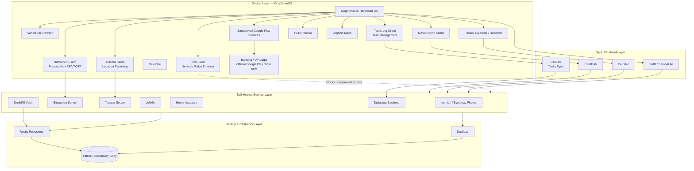
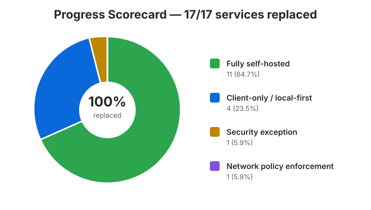
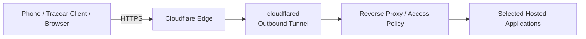
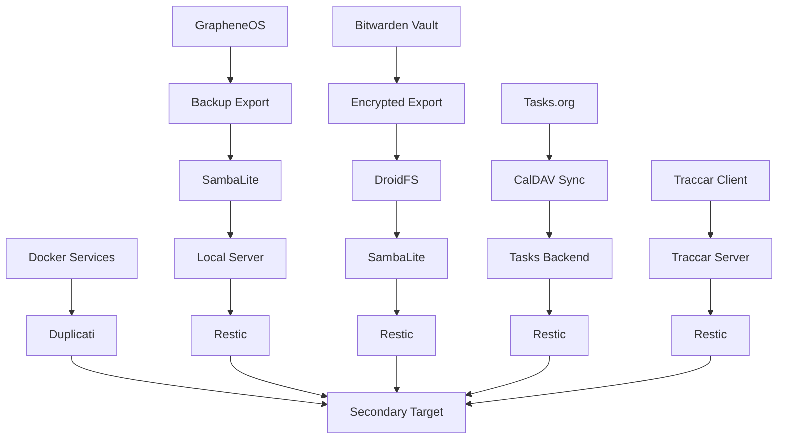

    <em><b><i>🔒 Privacy is a right. Protecting it is a choice.</b></i></em>

    
    
    
    

# De-Google Security & Data Sovereignty Architecture
**A Personal Privacy Infrastructure Blueprint** — GrapheneOS + self-hosted services + local-first design.

> Every category of personal data lives on infrastructure *I* control — no Google account, no vendor lock-in, independent encrypted backups.

| Metadata | Value |
|---|---|
| 📄 Document Type | Security Architecture / Privacy Infrastructure Whitepaper |
| 🔐 Classification | Personal — Non-Commercial |
| 🧩 Scope | Mobile OS, Identity, Data Storage, Backup, Automation |
| 🎯 Audience | Privacy seekers, Self-Hosters, GrapheneOS Users |
| 🟢 Status | Living Document |

## Table of Contents

1. 🏗️ [Architecture Overview](#1-architecture-overview)
2. 🛡️ [GrapheneOS Security Features](#2-grapheneos-security-features)
3. 🔄 [Google Service Replacement Matrix](#3-google-service-replacement-matrix)
4. 📊 [Progress Scorecard](#4-progress-scorecard)
5. 🗂️ [Data Ownership Matrix](#5-data-ownership-matrix)
6. 📝 [Architecture Decision Records](#6-architecture-decision-records)
7. 🔑 [Credential & 2FA Architecture](#7-credential--2fa-architecture)
8. 🌊 [Data Criticality Tiers & Flow](#8-data-criticality-tiers--flow)
9. 🌐 [Internet Access to Hosted Applications](#9-internet-access-to-hosted-applications)
10. 💾 [Backup Architecture](#10-backup-architecture)
11. 🚑 [Disaster Recovery](#11-disaster-recovery)
12. ⚔️ [Threat Model](#12-threat-model)
13. 🔗 [Remaining Google Dependency](#13-remaining-google-dependency)
14. ⚠️ [Security Exceptions](#14-security-exceptions)
15. 🚀 [What's Possible Next](#15-whats-possible-next)

---

## 1. Architecture Overview

**Goal:** Every category of personal data terminates on infrastructure the user controls (device or homelab), reachable over open protocols, with independent encrypted backups — no Google account dependency.

Four layers:

| Layer | What lives here |
|---|---|
| **Device** | GrapheneOS, Vanadium, sandboxed Google Play Services (compatibility and banking exceptions only), local-first apps, Traccar Client, and NetGuard |
| **Sync/Protocol** | CardDAV, CalDAV, SMB — open protocols, no vendor API in the path |
| **Self-Hosted Services** | Homelab/NAS: Immich, Bitwarden, Traccar Server, Jellyfin, Home Assistant, Tasks.org backend |
| **Backup/Resilience** | Restic + Duplicati, one copy always offline |

Device apps use local-first storage or talk to a self-hosted endpoint over a standard protocol. The self-hosted service is the single source of truth, and every service is included in an independent backup plan. Maps are the deliberate exception: HERE WeGo and Organic Maps are client-side navigation applications with downloadable offline map data rather than self-hosted map servers.

---

## 2. GrapheneOS Security Features

GrapheneOS is a security and privacy-focused mobile operating system based on the Android Open Source Project (AOSP). The features below are the security foundation for this architecture.

### Physical Access & Device Unlock Protections

- **Duress PIN / Password (Destructive PIN):** An alternate lock-screen PIN or password can trigger an irreversible wipe of the entire device, including eSIMs, at the OS level.
- **PIN Scrambling Layout:** Randomizes the number keypad placement on every unlock to reduce shoulder-surfing and fingerprint-smudge analysis.
- **USB-C Data Restrictions:** Blocks USB-C data connections while locked at the hardware and OS-driver levels.
- **Auto-Reboot Timer:** Automatically restarts the device after inactivity, moving it from After First Unlock (AFU) to Before First Unlock (BFU).
- **Two-Factor Fingerprint Unlock:** An optional second-factor short PIN can be required alongside biometrics.
- **128-Character Passwords:** Supports high-entropy passphrases longer than standard Android limits.

### Exploit Mitigation & Memory Hardening

- **Hardened Malloc & MTE:** Mitigates memory-corruption vulnerabilities such as use-after-free and buffer overflows.
- **Secure App Spawning:** Can disable the standard Android Zygote process model to reduce cross-process secret sharing.
- **Kernel & Browser Hardening:** Includes Vanadium, a hardened Chromium-based browser with JavaScript JIT disabled by default and control-flow protections.

### Network & Privacy Granularity

- **Network and Sensors Toggles:** Removes an application's internet or hardware-sensor access independently of ordinary permissions.
- **Storage and Contact Scopes:** Exposes only selected files, folders, or contact entries to an application.
- **LTE-Only Mode:** Reduces cellular-modem attack surface by disabling vulnerable legacy infrastructure.
- **Advanced Wi-Fi Anonymization:** Scrambles probe sequence numbers alongside MAC randomization.

### Hardware Attestation

- **Auditor App:** Uses hardware-backed verification and a secondary device to verify firmware, secure element, and operating-system integrity.

These controls are complementary: a strong passphrase and reboot policy protect data at rest, exploit mitigations reduce the impact of vulnerabilities, and scopes and toggles limit application access.

---

## 3. Google Service Replacement Matrix

| Google Service | Replacement | Self-Hosted | Local-First |
|---|---|:---:|:---:|
| Android | GrapheneOS | N/A | ✔ |
| Browser | [Vanadium](https://github.com/GrapheneOS/Vanadium) | N/A | ✔ |
| Contacts | DAVx5 + CardDAV | ✔ | ✔ |
| Calendar | Fossify Calendar + CalDAV | ✔ | ✔ |
| Tasks | **Tasks.org + CalDAV** | ✔ | ✔ |
| Maps | **HERE WeGo + Organic Maps** | ✖ | ✔ (offline maps) |
| Photos | Immich / Synology Photos | ✔ | ✔ |
| Password Manager + Authenticator | **Bitwarden (self-hosted)** — vault + built-in TOTP | ✔ | ✔ |
| YouTube | NewPipe | ✖ | N/A |
| Location History | **Traccar Client + Traccar Server** | ✔ | ✔ |
| Drive Sync | SambaLite | ✔ | ✔ |
| Drive (sensitive files) | DroidFS | Optional | ✔ |
| YouTube Music | Jellyfin / Poweramp | ✔ | ✔ |
| Recorder | Fossify Voice Recorder | ✖ | ✔ |
| Home | Home Assistant | ✔ | ✔ |
| Banking / UPI payments | Official apps from sandboxed Google Play Store — security exception | ✖ | Partial |
| Network Policy Engine | **NetGuard** — per-app firewall, LAN-only enforcement | N/A | ✔ |
| Backup | GrapheneOS Export + SambaLite + Restic/Duplicati | ✔ | ✔ |

### Maps: HERE WeGo and Organic Maps

- **HERE WeGo** remains the general-purpose navigation option for turn-by-turn routing, traffic-aware travel, transit support, and downloadable maps. It is a third-party service and is not self-hosted, so it should be used without an account where practical and with only the permissions required for navigation.
- **Organic Maps** is an open-source, privacy-oriented navigation and mapping application based on OpenStreetMap data. It supports downloadable offline maps, offline search, walking, hiking, cycling, and driving navigation. It is useful when navigation should continue without an internet connection or a persistent cloud account.
- Organic Maps is local-first for map browsing and navigation after the relevant regional maps have been downloaded. Map data still needs periodic downloads and updates, and routing quality, traffic information, and live transit features may differ from HERE WeGo.
- Download map regions over a trusted connection, keep the app and map data updated, and use GrapheneOS location controls to grant location access only while the app is in use. NetGuard can restrict network access after offline data is available, but doing so disables online updates and any online features.

**Only remaining Google footprint:** sandboxed Google Play Services and the Google Play Store, retained only for app compatibility and the banking/UPI security exception documented in [Section 14](#14-security-exceptions).

---

## 4. Progress Scorecard

  

| Metric | Value |
|---|---|
| Services replaced | 17 / 17 |
| Fully self-hosted | 11 |
| Client-only / local-first | 4 (Browser, Maps, YouTube, Voice Recorder) |
| Security exceptions | 1 (banking / UPI apps from sandboxed Google Play Store) |
| Network policy enforcement | 1 (NetGuard) |
| Remaining Google dependency | Sandboxed Play Services + Play Store exception |
| Account-level Google usage | 0% |

---

## 5. Data Ownership Matrix

| Data | Solution | Location | Encrypted | Backup |
|---|---|---|:---:|---|
| Contacts / Calendar | DAVx5 + Fossify | Local server | ✔ | Restic + Duplicati |
| Tasks | **Tasks.org + CalDAV** | Local server | ✔ | Restic + Duplicati |
| Photos / Videos | Immich / Synology Photos | Local NAS | ✔ | Restic + Duplicati |
| Passwords + 2FA/TOTP | **Bitwarden (self-hosted)** | Local server | ✔ (zero-knowledge) | Restic + Duplicati + encrypted vault export |
| Location History | **Traccar Client + Traccar Server** | Device + local server | ✔ | Restic |
| Maps and navigation data | **HERE WeGo + Organic Maps** | Device / downloaded offline maps | Device-level | Re-download from official app sources |
| Music / Video Library | Jellyfin / Poweramp | Local NAS | Optional | Restic |
| Voice Recordings | Fossify Voice Recorder | Device | Device-level | SambaLite + Restic |
| Device Backup | GrapheneOS Export | Local storage | ✔ | SambaLite + Restic |
| Sensitive Files | DroidFS | Local NAS | ✔ (client-side) | Restic |
| File Sync | SambaLite | LAN only | Transport-dependent | N/A |
| Browser Data | Vanadium | Device / user-controlled export | Device-level | GrapheneOS Export + SambaLite |
| Banking / UPI Data | Official apps from sandboxed Google Play Store | Device / provider systems | App- and provider-dependent | Provider-controlled |
| Network Policy | NetGuard rules | Device | N/A | Device config export |

---

## 6. Architecture Decision Records

| ADR | Decision | Replaces | Key Security/Privacy Win | Main Trade-off |
|---|---|---|---|---|
| 001 | GrapheneOS | Stock Android | Hardened allocator, MTE, sandboxed Play Services, scopes, toggles, and no forced Google account | Pixel-only hardware |
| 002 | DAVx5 | Google account sync | Open CalDAV/CardDAV protocols, no intermediary | Requires self-hosted DAV server |
| 003 | Fossify Calendar | Google Calendar app | No bundled analytics, local rendering | Fewer smart scheduling features |
| 004 | **Tasks.org + CalDAV** | Google Tasks | Open protocol task sync and self-hosted backend | Requires compatible task server |
| 005 | **HERE WeGo + Organic Maps** | Google Maps | Choice of traffic-aware navigation and privacy-oriented offline OSM maps | Neither is self-hosted; live features and map coverage differ |
| 006 | Immich | Google Photos | Local ML and no upload target | Requires compute and storage |
| 007 | **Vanadium** | Default browser | Hardened browser with privacy controls and no Google account requirement | Some web compatibility trade-offs |
| 008 | **Bitwarden (self-hosted)** | Google Password Manager + Authenticator | Zero-knowledge vault and built-in TOTP | Vault compromise exposes both factors |
| 009 | NewPipe | YouTube app | No embedded SDKs or account binding | Reverse-engineered API dependency |
| 010 | **Traccar Client + Server** | Google Location History | Phone reports location directly to a self-hosted server with user-defined retention | Needs reachable endpoint and client battery |
| 011 | SambaLite | Google Drive Sync | LAN-scoped, no cloud intermediary | No off-network access without VPN |
| 012 | Jellyfin | YouTube Music | Open-source and no telemetry | Manual library curation |
| 013 | Home Assistant | Google Home | Local automation execution | Some devices need cloud round-trips |
| 014 | **NetGuard** | Android network permissions model | Per-app firewall and explicit LAN-only enforcement | Requires active management |
| 015 | Restic | — | Encrypted, deduplicated, verifiable backups | CLI-driven; lost password is unrecoverable |
| 016 | Duplicati | — | Independent backup path and GUI recovery | Never the sole backup |
| 017 | DroidFS | Google Drive sensitive files | Client-side encryption before sync/storage | Manual mount/unmount step |
| 018 | Official banking and UPI apps | Untrusted APK mirrors | Known publisher and signed official-store update path | Retains narrowly scoped Google dependency |

---

## 7. Credential & 2FA Architecture

Passwords and TOTP/2FA secrets live in **one self-hosted Bitwarden vault**. Client-side encryption means the server stores encrypted blobs and never sees the master password or plaintext vault.

**DroidFS note:** use DroidFS for encrypted sensitive-file storage in the local-first design. If a paid solution is specifically required, use Cryptomator as the exception.

**Trade-off:** storing TOTP seeds with passwords reduces separation of secrets; a full vault compromise exposes both factors. This is accepted because the vault is locally encrypted, self-hosted, and protected by independent backups.

---

## 8. Data Criticality Tiers & Flow

| Tier | Assets | Why |
|---|---|---|
| **Tier-0** | Bitwarden vault, encryption keys, DroidFS recovery material, NetGuard policy config | Non-regenerable and gating |
| **Tier-1** | Contacts, calendars, tasks, Home Assistant, and Traccar data | Important but recreatable or re-syncable |
| **Tier-2** | Photos, videos, music, voice recordings, offline map data | Recoverable from other copies or re-downloadable |
| **Tier-3** | Banking and UPI applications | Financially sensitive; use only official distributions |

---

## 9. Internet Access to Hosted Applications

When the phone is away from the home network, hosted applications can be reached through a **Cloudflare Tunnel** and a reverse proxy rather than exposing the homelab's router ports directly.

The `cloudflared` connector runs inside the homelab and establishes an outbound, encrypted connection to Cloudflare. Public DNS names route to the tunnel; no inbound port-forwarding is required.

### Security and privacy considerations

- **Reduce network exposure:** The home router can keep inbound ports closed, reducing scanning and direct attack surface. This does not make applications safe by itself; each exposed application still requires hardening.
- **Encrypt in transit:** Use HTTPS at the Cloudflare edge and validate the tunnel-to-origin path. Do not treat the tunnel as a replacement for application-layer authentication.
- **Authenticate before forwarding:** Use Cloudflare Access, service-specific authentication, or both for administrative applications. Prefer identity-aware policies, MFA, short sessions, and device controls.
- **Expose the minimum:** Publish separate hostnames only for services that genuinely need internet access. Keep SMB, databases, Docker APIs, backup repositories, and management interfaces LAN-only or VPN-only.
- **Protect secrets:** Cloudflare can observe metadata and, depending on the configuration and termination point, plaintext application traffic. Do not expose unencrypted services or assume the tunnel removes third-party trust.
- **Limit service permissions:** Run `cloudflared` with least privilege, isolate it from unrelated containers, restrict origin firewall rules, and prevent the reverse proxy from becoming a general-purpose gateway.
- **Monitor and recover:** Review Cloudflare and reverse-proxy access logs, alert on unusual locations or request rates, rate-limit public endpoints, and have a plan to revoke tunnel credentials.
- **Client-side controls still apply:** On GrapheneOS, use separate user profiles where appropriate and use NetGuard to restrict which apps may reach public hostnames. Organic Maps can be kept offline after downloading map regions, while HERE WeGo may require network access for live features.

Cloudflare Tunnel improves reachability and removes inbound port-forwarding; it does not eliminate trust in Cloudflare, protect a vulnerable application, or replace strong authentication, patching, and segmentation.

---

## 10. Backup Architecture

- Vault exports and DroidFS data are encrypted before sync/storage.
- Restic and Duplicati provide independent backup paths.
- At least one copy is offline or not continuously network-reachable.
- Restic `check` and periodic test restores verify recoverability.
- Offline map data is convenience data, not a critical backup asset; it can be re-downloaded from the official Organic Maps or HERE WeGo distribution channels.
- Never export banking passwords, PINs, OTPs, tokens, or payment secrets through ordinary sync jobs.

---

## 11. Disaster Recovery

| Scenario | Recovery path |
|---|---|
| Device loss/failure | Restore GrapheneOS backup export and Bitwarden vault sync/export; reinstall and reconfigure Traccar Client and map applications; re-download offline maps |
| NAS failure | Restore services and media from Restic/Duplicati secondary repositories |
| Backup corruption | Use redundant tools and periodic verification |
| NetGuard config loss | Re-apply policy from device configuration backup |
| Cloudflare Tunnel compromise | Revoke tunnel credentials, recreate the connector, rotate Access credentials, and review origin logs |
| Banking / UPI app loss | Reinstall the official app from sandboxed Google Play Store and complete provider recovery; never use APK mirrors |

---

## 12. Threat Model

| Threat | Mitigation |
|---|---|
| Mass surveillance and advertising tracking | No unifying account; primary data path uses self-hosted, local-first services |
| Cloud account compromise | Data is fragmented across independent services |
| Vendor lock-in | CalDAV, CardDAV, SMB, and restic preserve portability |
| Excessive permissions | GrapheneOS scopes, toggles, and NetGuard per-app firewall |
| Unauthorized network access | NetGuard blocks outbound traffic except approved destinations where practical |
| Public service exploitation | Cloudflare Tunnel, closed inbound ports, reverse-proxy allowlists, MFA, patching, and service isolation |
| Cloudflare or tunnel credential compromise | Least privilege, MFA, credential rotation, origin restrictions, logs, and rapid tunnel revocation |
| Malicious or tampered financial APK | Install banking and UPI apps only from official Google Play Store listings in the sandboxed profile |
| Browser tracking | Vanadium is the default browser and requires no Google account |
| Location and map telemetry | Prefer Organic Maps for offline navigation, disable unnecessary location/network access, and use NetGuard where offline operation permits |
| Device compromise | GrapheneOS exploit mitigations, hardened malloc, MTE, secure app spawning, and Auditor attestation |
| Vault/2FA loss | Encrypted export chain with periodic restore testing |

---

## 13. Remaining Google Dependency

Sandboxed Google Play Services and the sandboxed Google Play Store are retained only as narrowly scoped exceptions. Play Services supports apps requiring push delivery or proprietary APIs. The Play Store is retained for official banking and UPI app distribution. No Google account is required for the primary data architecture, and map navigation can be performed offline with Organic Maps or HERE WeGo's downloaded maps.

---

## 14. Security Exceptions

### Banking and UPI payment applications

Banking and UPI applications must be downloaded from the **official Google Play Store running as a sandboxed GrapheneOS app**, not from APK mirrors, unofficial repositories, or random direct-download sites.

Users should verify the developer name, package identity, permissions, and update behavior. Recommended controls:

- Install only the bank or UPI provider's official listing from the sandboxed Play Store.
- Keep banking and payment apps in a separate user profile where practical.
- Never accept financial APKs sent through messages or email.
- Grant only required permissions and use NetGuard restrictions where possible.
- Use device unlock, app security features, transaction notifications, and provider recovery controls.
- Never include banking passwords, PINs, OTPs, tokens, or payment secrets in SambaLite, Restic, Duplicati, or ordinary device exports.

### Maps and navigation applications

Use **Organic Maps** when privacy, offline operation, and OpenStreetMap-based navigation are the priority. Download only the regions needed, update them periodically over a trusted network, and allow location access only while in use. Because navigation and search can operate from downloaded data, network access can be blocked with NetGuard after map downloads complete.

Use **HERE WeGo** when traffic-aware routing, transit information, or broader online navigation features are more important. Treat it as a third-party service rather than a self-hosted or fully local solution, and review its permissions and account settings before use.

### Vanadium as the default browser

[Vanadium](https://github.com/GrapheneOS/Vanadium) replaces the default browser application. It is the general-purpose browser for this architecture, with GrapheneOS hardening, JavaScript JIT disabled by default, and no Google account requirement.

### Hardware and physical-access baseline

Use a long passphrase, enable the auto-reboot timer, keep USB-C data restricted while locked, configure the duress PIN only after understanding its irreversible wipe behavior, and periodically use Auditor to verify device integrity.

---

## 15. What's Possible Next

| Idea | What it would replace | Enables |
|---|---|---|
| Self-hosted email | Third-party email provider | Full mail sovereignty |
| Self-hosted document storage/editing | Google Docs/Drive | On-prem office suite |
| Self-hosted search index | Commercial search engines | Local lookup over self-hosted data |
| Local AI inference | Cloud AI providers | ML without sending personal data out |
| Network segmentation | Flat homelab network | Limits lateral movement |
| Automated backup validation | Manual restore checks | Continuous proof of recoverability |
| FIDO2 hardware key | Bitwarden-only 2FA | Second factor independent of the vault |
| Advanced threat analysis | Manual NetGuard review | Earlier detection of abnormal behavior |

---

📌 *Living document — update as components are added, replaced, or deprecated.*
